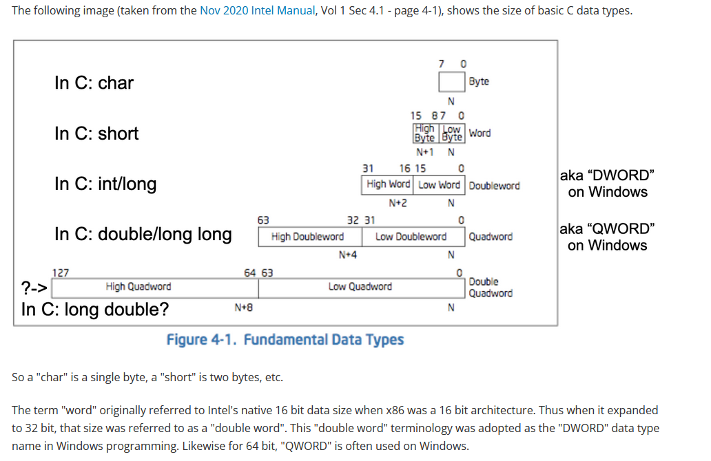
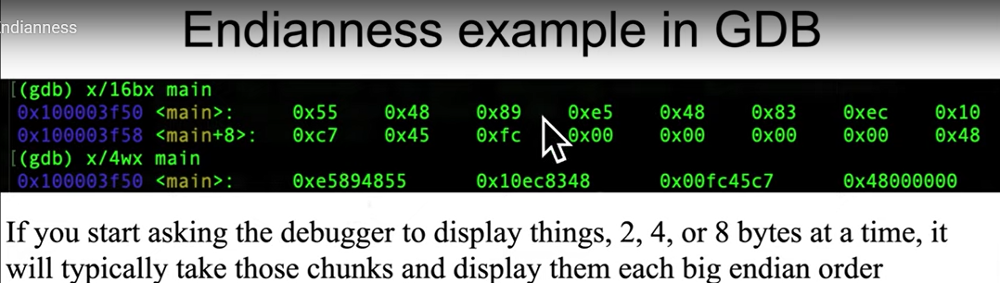

#### Vì sao cần học Asssembly
1. Kĩ năng ít người có thì lương cao hơn???
2. Cần thiết để làm reverse engineering cho malware và chương trình bình thường.
3. Viết memory corruption exploits
4. Create secure architectures $\to$ new hardware security $\to$ new assembly instruction
5. Job: security architect, malware analysis, vulnerability hunter, exploit writer
6. Các paper thường sử dụng assembly là minh chứng cho việc tồn tại vulnerability nên phải học để hiểu.
#### C data type sizes

In C
char = 1 byte
word = 2 bytes
dword (double word) = 4 bytes
qword (quad word) = 8 bytes
dqword (double quad word) = 16 bytes.
#### Endianess
- Little Endian means the least significant byte (LSB) of a word or larger is stored in the lowest address (mostly stored in RAM), for example, 0x12345678 $\to$ 0x78 (in lowest address), 0x56, 0x34, 0x12.
- Big Endian which means the most significant byte (MSB) of a word or larger is stored in the lowest address (mostly stored in RAM), for example, 0x12345678 $\to$ 0x12 (in lowest address), 0x34, 0x56, 0x78.
- Endianess **_applied to memory, not register_** and **_applied to byte not bit_**. Register is always big endianess, which means the most significant byte is always on the left hand side.
- Intel is Little Endian. Network traffic is sent in Big Endian.
#### Endianess expressed in applications

Trong các công cụ, `register view` để xem giá trị thanh ghi sẽ luôn ở dạng Big Endian còn nếu xem `memory dump` sẽ được sắp xếp theo thứ tự từ trái sang phải, từ trên xuống dưới, tức byte trên cùng phía trái sẽ là nơi có địa chỉ thấp nhất, và byte ở dưới cùng bên phải sẽ là nơi có địa chỉ cao nhất. Tuy nhiên, để thuận tiện cho người dùng (vì đọc Little Endian khá đau đầu), thì khi biểu diễn dưới dạng 2, 4, 8 bytes cùng một lúc (thay vì 1 byte một thời điểm như trong ảnh trên), thì chương trình sẽ tự động đảo hộ sang Big Endian tương ứng với số byte biểu diễn cùng lúc đó. Như trong ví dụ trên, nếu chuyển display size sang 4 byte sẽ được như hình 1 và nếu chuyển sang display size 8 byte sẽ được chuyển sang như hình 2.

Tương tự với GDB khi sử dụng display size là 1 byte (lệnh trên) và 4 byte (lệnh dưới).
