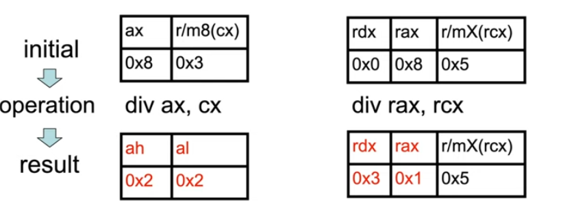
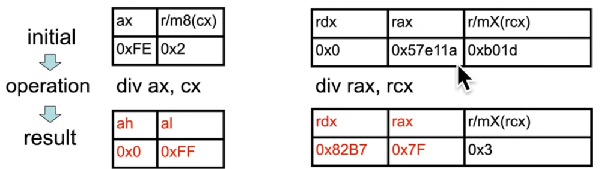

## Instruction: div, idiv
- `div` (unsigned divide) instruction actually takes 1 parameter, not 2. Visual Studio show 2 parameters since that way you dont need to remember that `ax`, `eax`, `rax` are implicitly the dividend (số bị chia), but other disassemblers, like IDA, may show you the more accurate instruction like `div rcx` and expect you to remember that it's dividing `rax` by `rcx`. If dividend is 32/64 bits, `edx`/`rdx` will be set to 0 by the compiler before the instruction. If the divisor (số chia) is 0, a divide by zero exception is raised. `div` has 3 forms:
    - unsigned divide `ax` by `r/m8`, `al` register is `quotient` (thương), `ah` register is `remainder` (số dư)
    - unsigned divide `edx`:`eax` by `r/m32`, `eax` register is `quotient`, `edx` register is `remainder`
    - unsigned divide `rdx`:`rax` by `r/m64`, `rax` register is `quotient`, `rdx` register is `remainder`
- Example, `8 / 3 = 2 remain 2`, `8 / 5 = 1 remain 3`

- `idiv` (signed divide), same register with `div`
- Example, `-2 (0xfe) / 2 = -1 (0xfe) remain 0`, `5759258 (0x57e11a) / 45085 (0xb01d) = 127 (0x7f) remain 33463 (0x82b7)`

