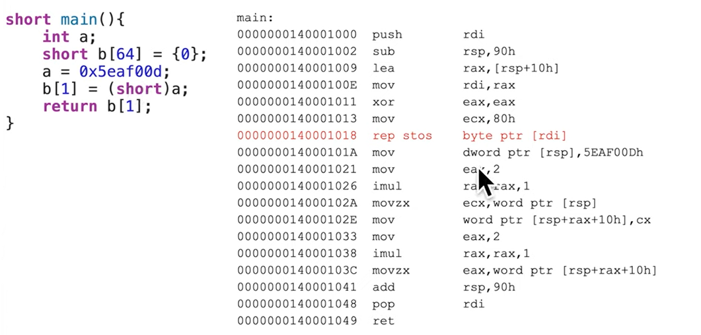

## Instruction: rep stos
- `rep stos` (repeat store string) 
- `stos` là một trong số nhiều những câu lệnh mà có thể thêm tiền tố "rep", cho phép thực hiện một câu lệnh nhiều lần. Tất cả các lệnh lặp lại này đều sử dụng thanh ghi `*cx` (tức `rcx`, `ecx`,...) làm "counter" để xác định số lần lặp lại câu lệnh, mỗi lần thực hiện thành công thì thanh ghi `*cx` sẽ giảm đi 1 và khi thanh ghi `*cx` bằng 0 thì nó sẽ thực hiện câu lệnh tiếp theo. Lệnh này sử dụng để lưu trữ 1, 2, 4 hoặc 8 bytes cùng một lúc vào địa chỉ mà thanh ghi `rdi` trỏ tới (tức trong ngôn ngữ assembly là dùng [`rdi`]) tương ứng từ `al`, `ax`, `eax` và `rax`. Mỗi lần thực hiện vòng lặp sẽ tương ứng tăng giá trị của thanh ghi `rdi` lên tương ứng (tức tăng địa chỉ lên) để cho phép các giá trị được lưu ở các vị trí liền kế nhau. Do đó, các công việc cụ thể cần xử lý trước khi thực hiện `rep stos` là: thiết lập `rdi` đến vị trí bắt đầu, thiết lập `rax`/`al` bằng với giá trị chuẩn bị lưu, thiết lập `rcx` bằng với số lần thực hiện lưu.
- Chức năng hoạt động của stos là tương tự với `memset()` trong ngôn ngữ lập trình C và thỉnh thoảng compiler sẽ tự động chuyển thành lệnh này luôn khi sử dụng `memset` trong C.
- Example: 
    - hàm `main` sử dụng thanh ghi rdi cho việc đếm tại `rep stos`, mà `rdi` lại là non-volatile register nên cần lưu giá trị trước đó, sau khi tính toán xong sẽ trả lại giá trị cũ.
    - cấp phát bộ nhớ 90h (144 in decimal) bytes, bao gồm: 128 bytes (mảng b) + 4 bytes (biến a) + padding (để chia hết cho 16), ở đây không có shadow space vì không gọi hàm khác.
    - `rep stos byte` nên copy từng byte một, chứ không phải từng phần tử short (2 bytes), nên cần gấp đôi kích cỡ là 64 * 2 = 128 (80h)

## Instruction: rep movs
- `rep mov` (repeat move data string to string), hiểu đơn giản là thực hiện lệnh `movs` nhiều lần và bản thân lệnh `movs` không có tiền tố `rep` thì nó vẫn có tác dụng.
- `movs` có thể sử dụng để chuyển giữa memory và memory (khác so với mov), nhưng chỉ diễn ra được giữa 2 [*si] và [*di].

