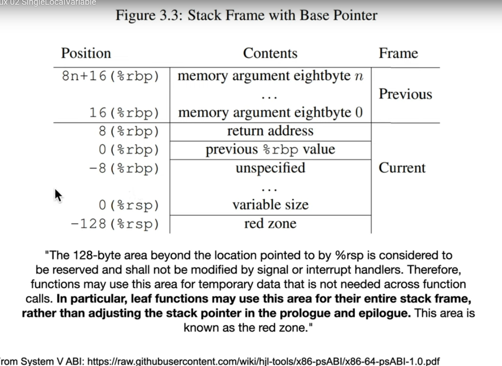
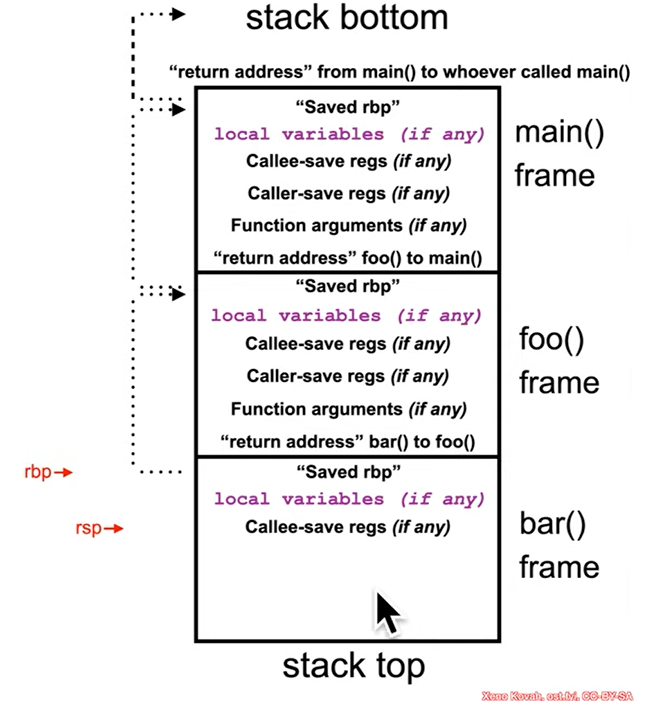
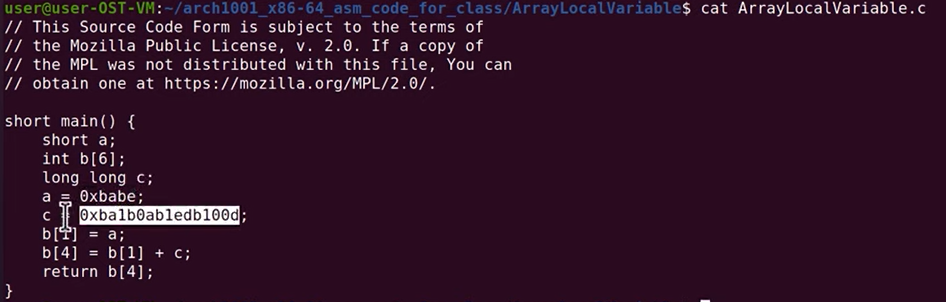
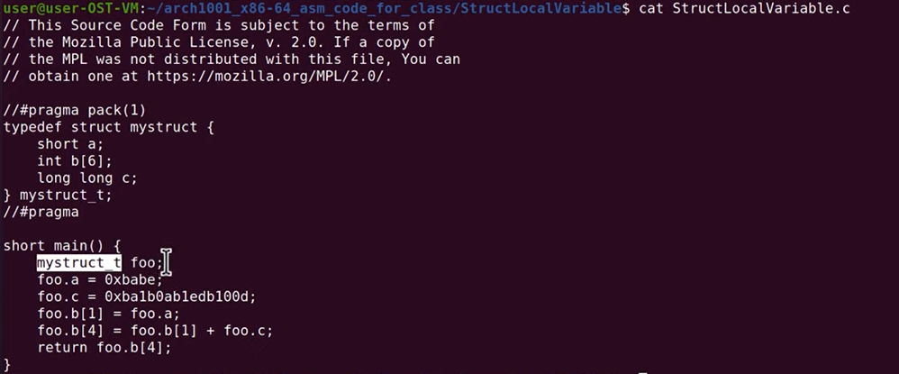
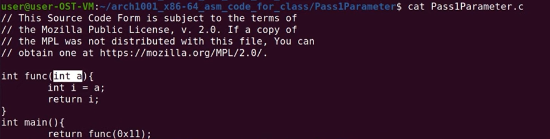
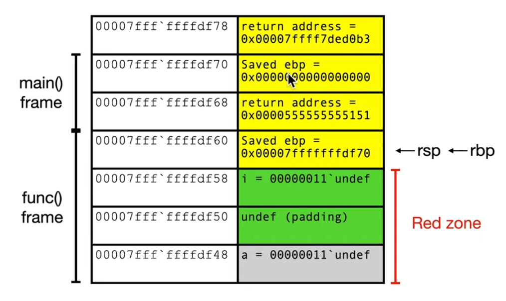

- Có 2 loại cú pháp hay được sử dụng là Intel Syntax cho kiến trúc x86 và AT&T Syntax cho các hệ thống kế thừa từ UNIX.
- Cần phải biết cả 2 loại cú pháp này vì Security Reseacher sẽ có thể viết dưới dạng cả 2 loại cú pháp và cần phải đọc hiểu các báo cáo này.
- Intel Syntax được ưa chuộng sử dụng cho Windows (và sự thật là nó đọc dễ hiểu hơn thật) với thứ tự sẽ từ trái sang phải, cụ thể: `des <- source`
- AT&T Syntax được ưa chuộng sử dụng trên các hệ thống kế thừa từ Unix và GNU với thứ tự cú pháp sẽ là `source -> des`, trong đó register get a % prefix and immediates get a $.
- Một vài sự khác nhau đáng chú ý như sau:
    - Indicate sizes:
        - Intel indicates size like `mov qword ptr [rax], rbx`
        - AT&T Syntax indicates the size of memory operand is determined from the last character of the instruction, ví dụ: `movq` operates on quad word (qword). Do đó, vài lệnh sẽ được đổi tên to better conform to naming convention for lengths, ví dụ: `cwde` -> `cwtl` (convert sign extend word to long), `movsx` -> `movsbw`
        - `movslq %eax, %rdx` in AT&T Syntax have the same meaning with `movsxd rdx, eax` in Intel Syntax
    - Tính toán
        - `[base + index*scale + disp]` trong Intel tương đương trong AT&T `disp(base, index, scale)`, ví dụ: `call qword ptr [rbx+rsi*4-0xe8]` tương đương `callq *-0xe8(%rbx,%rsi, 4)`, tuy nhiên có vài trường hợp đặc biệt, ví dụ: `mov rdi, qword ptr[rsi+0x8]` có thể được viết thành `mov 0x8(%rsi),%rdi` hoặc `movq` đều được (vì khuyết index và scale), nhưng thường là compiler sẽ lựa chọn cách viết `mov`.
- `endbr` (end branch) is a security feature (`CET`, `control flow enforcement technology`, của intel nhằm đánh dấu các điểm an toàn cho các lệnh nhảy gián tiếp như `jump` và `call`, để nếu CPU nhảy đến một địa chỉ mà lệnh đầu tiên không phải là `endbr` thì sẽ coi đó là hành vi bất thường và crash), when the code is run on system doesn't support this, it acts as nop assembly instruction
- AT&T Syntax được sử dụng trên Linux, Unix, GDB, GCC mặc định và Intel Syntax được dùng cho Windows, các công cụ dịch ngược như IDA, Ghida.
## Example
### SingleLocalVariable.c

- Trong `System V ABI` của Linux/Unix (Windows không có phần này), stack frame sẽ chia ra làm 3 khu vực chính:
    - Khu vực trên `rbp`: vùng của caller, chứa các arguments và return address.
    - Khu vực giữa `rbp` và rsp: vùng stack frame tiêu chuẩn của một hàm, muốn sử dụng phải thực hiện lệnh `sub rsp, X` để nới rộng stack ngay đầu hàm. Ví dụ như vùng `main() frame` trong hình này
    
    `rbp` của hàm sau luôn trỏ ngược về `rbp` của hàm trước đó để tạo thành một linked list, giúp lần ngược lại lịch sử gọi hàm (stack trace).
    - Khu vực dưới `rsp`: vùng redzone. Thông thường, nếu có một ngắt hệ thống xảy ra bất ngờ, hệ điều hành sẽ lưu trạng thái xử lý ngắt vào khu vực này. Tuy nhiên `System V ABI` đưa ra cam kết sẽ không bao giờ chạm vào 128 bytes ngay phía dưới `rsp`, mà nó sẽ bỏ trống 128 bytes rồi mới ghi dữ liệu (tức là nó sẽ ghi tại byte thứ 129). Vậy thì 128 bytes này được sử dụng cho leaf function (tức các hàm không gọi hàm nào nữa)
- Chú thích (nguồn Gemini):
    - Trong hiện đại thì compiler thường bỏ qua `rbp` mà quản lý mọi thứ bằng `rsp` luôn để tiết kiệm lệnh
    - `return address` chuẩn là phải nằm ở `previous frame` chứ không phải `current frame`, vì caller frame là nơi gọi hàm `call` và đẩy return address vào stack, tuy nhiên với góc nhìn ngữ cảnh, `return address` cũng có ý nghĩa quan trọng đối với callee function, do đó nhiều tài liệu vẫn ghi return address thuộc sở hữu của `current frame`
    - `rbp` đóng vai trò là trần và `rsp` đóng vai trò là sàn chứa toàn bộ stack frame của một hàm, khi cần khai báo thêm biến thì sàn sẽ hạ thấp xuống.
    - Khi sử dụng `-fstack-protector`, compiler sẽ chèn giá trị canary (một giá trị đặc biệt nào đó) ngay sát bên dưới địa chỉ mà `rbp` đang trỏ tới, cụ thể trên kiến trúc 64 bit thì nó nằm ở `rbp - 8`. Vì lỗ hổng Buffer Overflow thường bắt nguồn từ việc xuất phát từ các biến cục bộ rồi cố gắng tràn ngược lên trên để ghi đè lên `saved rbp` (`rbp + 0`) và `return address` (`rbp + 8`), và nếu muốn ghi đè thì bắt buộc phải ghi đè lên cả giá trị canary. Do vậy, tại cuối mỗi hàm chỉ cần sử dụng hàm kiểm tra giá trị canary là được, nếu nó khớp thì cho return còn không thì báo lỗi.
### ArrayLocalVariable.c

- `0xbabe` được lưu tại `rbp - 0x2` cụ thể `0xbe` sẽ được lưu tại `rbp - 0x2` còn `0xba` sẽ được lưu tại `rbp - 0x1`. Khi hiển thị trên gdb sẽ được biểu diễn dưới dạng big endian cho người dùng dễ đọc, mà big endian nghĩa là sẽ hiển thị most significant byte lên trước để đọc như người đọc số bình thường, mà thực tế dữ liệu lưu trữ trong máy tính lại ở dạng little endian, tức least significant byte sẽ được lưu tại địa chỉ thấp nhất (tức `rbp-0x4`), do đó sẽ biểu diễn `0xbabe` (nằm ở `rbp - 0x1` và `rbp - 0x2` trước `rbp - 0x3` và `rbp - 0x4`) và hiển thị là `0xbabe7fff`.
    ```
    (gdb) si
    0x0000555555555137 in main ()
    1: x/10i $rip
    => 0x555555555137 <main+14>:    movabs $0xba1b0ab1edb100d,%rax
    0x555555555141 <main+24>:    mov    %rax,-0x10(%rbp)
    0x555555555145 <main+28>:    movswl -0x2(%rbp),%eax
    0x555555555149 <main+32>:    mov    %eax,-0x2c(%rbp)
    0x55555555514c <main+35>:    mov    -0x2c(%rbp),%eax
    0x55555555514f <main+38>:    mov    %eax,%edx
    0x555555555151 <main+40>:    mov    -0x10(%rbp),%rax
    0x555555555155 <main+44>:    add    %edx,%eax
    0x555555555157 <main+46>:    mov    %eax,-0x20(%rbp)
    0x55555555515a <main+49>:    mov    -0x20(%rbp),%eax
    2: /x $rbp = 0x7fffffffdc90
    3: /x $rsp = 0x7fffffffdc90
    4: /x $rax = 0x555555555129
    5: /x $rbx = 0x7fffffffddb8
    6: /x $rcx = 0x555555557df8
    7: /x $rdx = 0x7fffffffddc8
    8: /x $rdi = 0x1
    9: /x $rsi = 0x7fffffffddb8
    10: /x $r8 = 0x0
    11: /x $r9 = 0x7ffff7fca380
    12: /x $r12 = 0x1
    13: /x $r13 = 0x0
    14: /x $r14 = 0x555555557df8
    15: x/10xg $rsp
    0x7fffffffdc90: 0x00007fffffffdd30      0x00007ffff7c2a1ca
    0x7fffffffdca0: 0x00007fffffffdce0      0x00007fffffffddb8
    0x7fffffffdcb0: 0x0000000155554040      0x0000555555555129
    0x7fffffffdcc0: 0x00007fffffffddb8      0x2e0f48680b27b3b2
    0x7fffffffdcd0: 0x0000000000000001      0x0000000000000000
    16: x/11xw $rbp-0x2c
    0x7fffffffdc64: 0x00000000      0x00000000      0x00000000      0x00000000
    0x7fffffffdc74: 0x00000000      0xf7fe5af0      0x00007fff      0xffffdd70
    0x7fffffffdc84: 0x00007fff      0xffffddb8      0xbabe7fff
    (gdb) x/1hx $rbp-0x2
    0x7fffffffdc8e: 0xbabe
    ```
- `movabs` can be used to encode the `mov` instruction with the 64-bit displacement or immediate operand.
### StructLocalVariable.c

- `cwtl` (convert word to long)
- Việc thêm/bỏ `#pragma` sẽ làm thay đổi hoàn toàn kích trước và cách bố trí bộ nhớ của struct này trong RAM. Cụ thể:
    - Trường hợp có `#pragma pack(1)`, compiler sẽ sắp xếp các biến sát sàn sạt vào nhau, căn chỉnh theo 1 byte và do đó không có kẽ hở nào cả. 
    ```
    16: x/12xw $rbp-0x30
    0x7fffffffdc80: 0xabcdbabe      0xcdef0000      0x12340000      0x56780000
    0x7fffffffdc90: 0x12ab0000      0x34cd0000      0x100d0000      0xb0ab1edb
    0x7fffffffdca0: 0xffff0ba1      0x00007fff      0xffffddd8      0x00007fff
    ```
    - Trường hợp không có `#pragma pack(1)`, compiler sẽ sử dụng chế độ `natural alignment` để căn chỉnh kích cỡ tự nhiên nhằm tối ưu tốc độ CPU. CPU truy xuất dữ liệu nhanh nhất khi địa chỉ của biến chia hết cho kích thước của nó (ví dụ, biến `int` là 4 byte thì địa chỉ của biến này phải nằm ở địa chỉ chia hết cho 4) và hệ quả là sẽ có hiện tượng padding để các biến nằm ở vị trí tối ưu.
    ```
    16: x/10xw $rbp-0x30
    0x7fffffffdc80: 0x0000babe      0x0000abcd      0x0000cdef      0x00001234
    0x7fffffffdc90: 0x00005678      0x000012ab      0x000034cd      0x00007fff
    0x7fffffffdca0: 0x1edb100d      0x0ba1b0ab
    ```
- Địa chỉ của các `member` trong `struct` trong bộ nhớ phải giống hệt thứ tự khai báo trong code, địa chỉ của `member` khai báo trước luôn nhỏ hơn địa chỉ của `member` khai báo sau. Tuy nhiên, không có quy định nào quyết định thứ tự của biến local trong bộ nhớ, compiler sẽ có toàn quyền quyết định các biến này và thường sẽ cố gắng nhét các biến nhỏ vào các khe hở để tiết kiệm stack.
### Pass1Parameter.c


- `0x555555555137 <func+14>:    mov    %eax,-0x4(%rbp)` nếu muốn xem giá trị tại lệnh này thì cần sử dụng `x/5xw $rbp-0x14` vì tổng dung lượng xem được của lệnh `x/4wx` là 4 * 4 = 16 bytes, bao gồm từ `$rbp - 0x14` (byte từ -20 đến -17) đến `$rbp - 0x8` (byte từ -8 đến -5), trong khi giá trị cần xem lại nằm tại `$rbp - 0x4`, tức giá trị từ `$rbp - 0x4` đến `$rbp`.