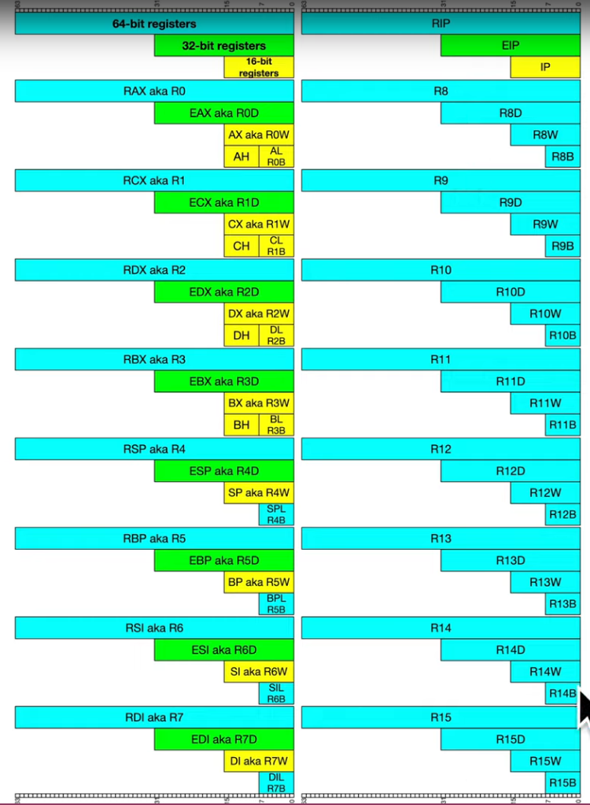

### Memory Hierarchy

small size + small capacity $\to$ fast + expensive
speed decrease, size and capacity increase: register $\to$ cache $\to$ RAM $\to$ flash or usb memory $\to$ hard drives $\to$ tape backup

### Architecture - Registers

- register is volatile memory.
- instruction pointer and "general purpose" registers.
- in x86-32 registers are 32 bits wide.
- in x86-64 registers are 64 bits wide.

x86-64 general purpose register

There is Intel's suggestions to compiler developers about register conventions, but register don't have to be used these way.
RAX (R1) - stores functions return value. `eax` is 32-bits LSB of `rax`, `ax` is 16-bits LSB of `eax`, `AH` is 8-bits MSB of `ax` and `AL` is 8-bits LSB of `ax`.
RCX - counter for string and loop operations
RSI - source index pointer for string operations
RDI - destination index pointer for string operations
RSP - stack pointer
RBP - stack frame base pointer
RIP - instruction pointer (pointer to next instruction)
### Instruction
#### NOP
- viết tắt của No-Operation, tức là không làm gì cả
- không truyền thêm bất kì thanh ghi, giá trị nào cả
- sử dụng để padding/align bytes hoặc delay
- attackers sử dụng để đánh dấu là đã exploit thành công