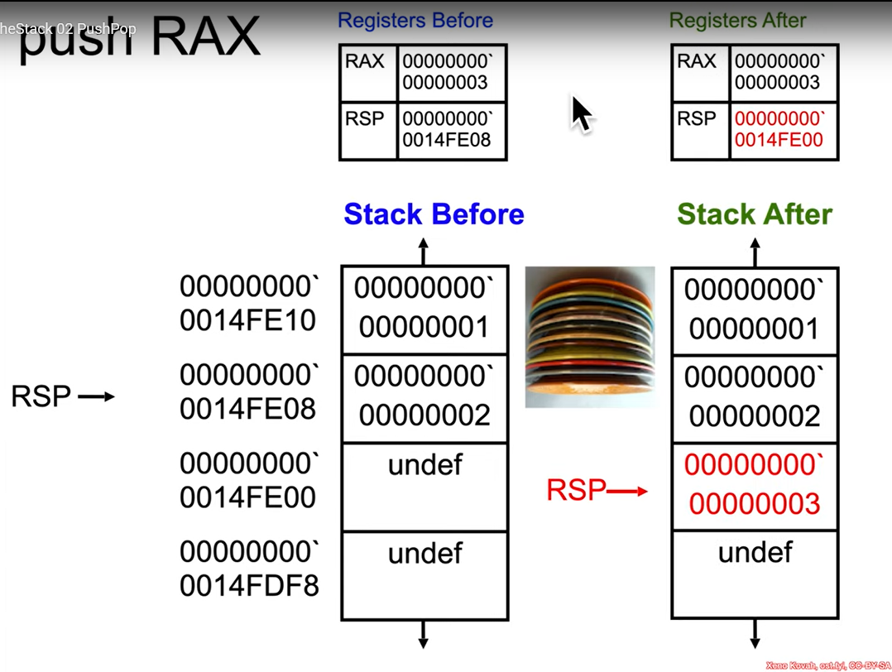
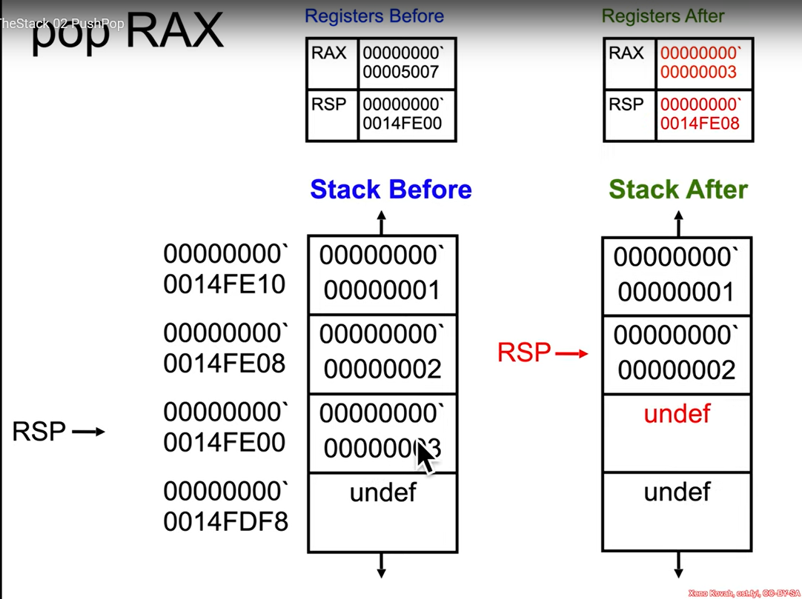

## The Stack
- `stack` là một khu vực "trừu tượng" nằm trong RAM mà OS cấp phát cho một chương trình khi chương trình đấy chạy. Tùy hệ điều hành và có sử dụng address space layout randomization (ASLR) hay không mà `stack` sẽ bắt đầu tại những vị trí khác nhau.

- `RSP` trỏ đến đầu của `stack` tức nơi có địa chỉ bé nhất, những giá trị nào nằm ngoài khoảng xác định sẽ được coi là `undefined`
- những thông tin có thể tìm thấy trong `stack`: `return addresses`, `local variable`, truyền `argument` giữa các `functions`, cấp phát động thông qua `alloca()`, tiết kiệm không gian cho `register`.
- `rsp` không tự giảm sau khi thực hiện mỗi dòng lệnh mà chỉ thay đổi khi gặp những lệnh cụ thể liên quan đến stack. Hầu hết các lệnh assembly như cộng trừ nhân chia, gán dữ liệu đều giữ nguyên `rsp`. Cụ thể như sau:
    1. Nhóm lệnh tự động thay đổi `rsp` bao gồm: `push` để đẩy giá trị vào stack nên `rsp` sẽ giảm 8 để dành chỗ cho giá trị mới, tương tự `pop` để lấy giá trị ra khỏi stack nên `rsp` sẽ tăng 8 để trả lại chỗ chống (chú ý rằng địa chỉ stack giảm dần nên nó mới thế này), `call` sử dụng để lưu địa chỉ quay về nên nó sẽ giảm 8 để đưa địa chỉ return address vào, `ret` để thoát hàm nên `rsp` sẽ tăng 8 để pop địa chỉ return address để quay về. 
    2. Nhóm lệnh thủ công thay đổi: `add` và `sub`, sau khi cộng và trừ xong thì nó sẽ không làm thêm gì với `rsp` nữa.
- `byte addressing` là khái niệm cơ bản của kiến trúc máy tính hiện đại. Trong phần lớn các kiến trúc hiện đại, ví dụ như x86-64, memory được tổ chức dưới dạng mảng bytes, cụ thể, address 0x...00 giữ 1  giá trị, address 0x...01 giữ 1 bytes giá trị khác,...bởi vì mỗi memory address biểu diễn tương ứng 1 byte giá trị lưu trữ nên các tính toán với pointer bắt buộc phải phản ánh kích cỡ của nó, tức đơn vị sau khi tính toán xong phải là bytes chứ không phải là bits.
- `stack trace` (hay `backtrace`) và `stack frame` không giống nhau nhưng có liên quan đến nhau. Cụ thể, `stack frame` là một vùng nhớ cụ thể trong memory được 1 hàm duy nhất sử dụng để lưu dữ liệu, còn `stack trace` là một danh sách các `stack frame` đang hoạt động tại một thời điểm. Hiểu đơn giản thì `stack frame` là một bức tường còn `stack trace` là một viên gạch trong bức tường đó.
$\to$ Hiểu ngắn gọn là trong các kiến trúc hiện đại, người ta quy ước là mỗi địa chỉ trong memory biểu diễn được 1 bytes giá trị. Nếu quy ước ngắn lại là mỗi địa chỉ trong memory chỉ biểu diễn được 1 bit giá trị, thì với cùng một memory size (ví dụ thanh RAM 4GB) số lượng địa chỉ sẽ tăng lên và để truy cập được hết đống địa chỉ đấy thì pointer cũng phải tăng kích cỡ lên vài bit, đồng thời CPU cũng sẽ tốn thời gian để di chuyển giữa các địa chỉ, ngược lại là có thể truy cập chính xác từng vị trí trong memory. Hiểu đơn giản là xây các trạm dừng chân tàu hỏa quá khít thì đi bộ ít, nhưng mà thời gian dừng chờ người khác xuống lại lâu, và ngược lại với việc xây các trạm thưa. Kĩ sư chọn 1 địa chỉ biểu diễn 8 bytes giá trị vì 1 kí tự tiếng anh tiêu chuẩn biểu diễn trong 7 hoặc 8 bits, do đó xử lý text sẽ nhanh hơn (hơi khó hiểu nhưng tạm thế???). 
### Push and Pop Instruction
- không có push and pop trong visual studio?
- 32-bit mode $\to$ push/pop will add/remove value 32 bits a time rathar than 64 bit and thus they decrement/increment rsp by 4 rather than 4 at a time, likewise in 16 bit mode.
#### Push
- push quadword (8 bytes) onto the stack, which means put a value on top of the stack, and also decrease the `rsp` so that it can point to the value have just been put.
- decrements the stack pointer RSP by 8 (not 8 bytes, 8 bits, just 8, because this is the value of address, 8 is because push quadword onto the stack), stack address decrease, so the more growth the smaller address.
- operand can be the value of register or value from memory
- in Intel syntax, `[]` means to fetch the value at that address (like dereferenceing a pointer)
- `r/mX` can take 4 forms:
    - register $\to$ `rbx`
    - memory, base-only $\to$ `[rbx]`
    - memory, base+index*scale $\to$ `[rbx+rcx*X]`
    - memory, base+index*scale+displacement $\to$ `[rbx+rvx*X+Y]`
- `r/mX` example:
    - push register : `push rbx`
    - push memory : `push [rbx]`, `push [rbx+rcx*4]`, `push [rbx+rcx*8+0x20]`
- WinDbg sử dụng kí hiệu "`" để ghi chú mỗi 32 bit cho dễ đọc.
- `stack` trước và sau khi thực hiện lệnh `push rax`

#### Pop
- pop a value from the stack, which means "get" the value on top of the stack, then increase it so that it can point to another memory location.
- operand can be register or memory address in the form `r/mX` 
- `stack` trước và sau khi thực hiện lệnh `pop rax`


## The RSP Game
```
HIGH ADDRESSES
================
5eaf00d <- RBP
================
c0ffee
================
ba1dd00d
================
F01dab1eF007ba11
================
f00d <- RSP
================
LOW ADDRESSES

What is the offset to c0ffee ?

(Enter answer in the form of "rsp{+,-}0x??" or "rbp{+,-}0x??",

where ?? must always be 2 digits, e.g. rsp-0x00 or rbp+0x08)
```
answer `rbp-0x08` or `rsp+0x18`
