## Exercise SingleLocalVariable.c
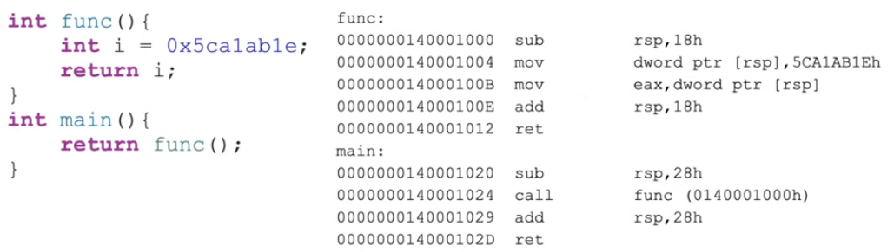
```c++
int func() {
    int i = 0x5ca1ab1e;
    return i;
}

int main() {
    return func();
}
```
### Key
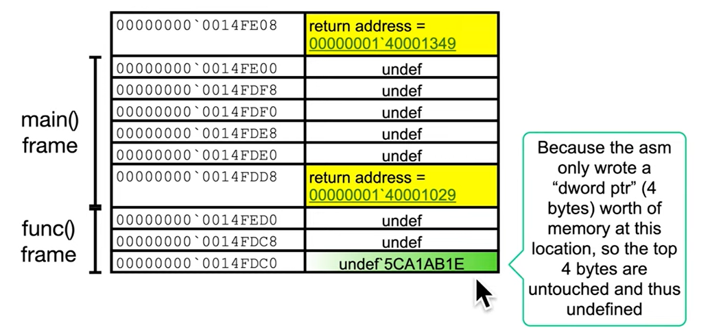

## Exercise SingleLocalVariable2.c
```c++
int func3() {
    int i = 0x7a11;
    return i;
}
int func2() {
    int j = 0x7a1e;
    return func3();
}
int func() {
    return func2();
}
int main() {
    return func();
}
```
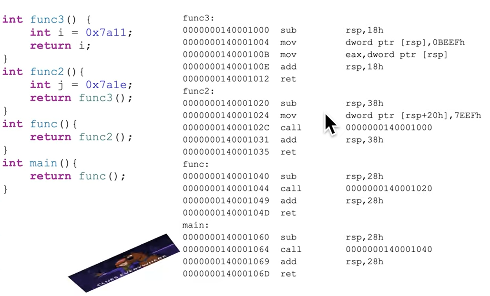
### Solution
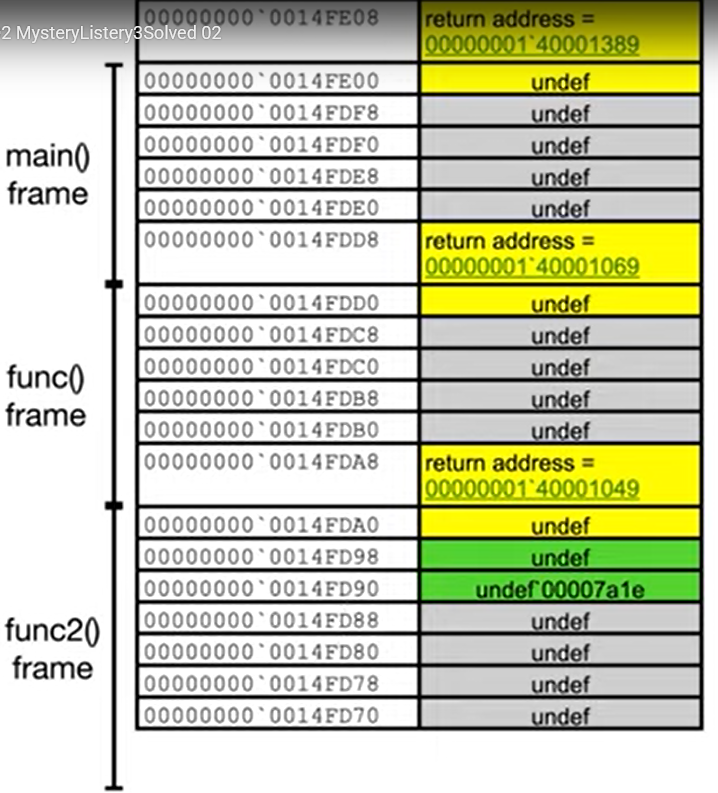
**continue**
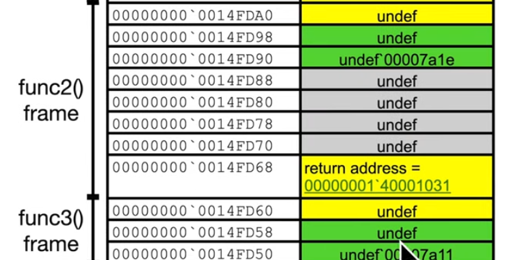
### Explain
1. Trước khi chương trình khởi chạy, về lí thuyết là có một hàm khác gọi hàm `main()` (có thể chạy trong objdump file object) nên do đó vẫn phải lưu return address của hàm `main()` và sẽ bắt đầu tại địa chỉ này luôn là `14fe08` (như trong hình mô tả là `main()` frame cũng tính từ giá trị này).
2. `sub rsp, 28h` $\to$ `rsp = 14fe08 - 28 = 14fde0`
3. `call func` $\to$ `rsp = 14fde0 - 8 = 14fdd8`, 14fdd8 chứa return address của hàm main() tức là cái lệnh thực hiện tiếp theo sau khi có giá trị trả về.
4. `sub rsp, 28h` $\to$ `rsp = 14fdd8 - 28 = 14fdb0`
5. `call func2` $\to$ `rsp = 14fdb0 - 8 = 14fda8`, 14fda8 chứa return address của hàm func()
6. `sub rsp, 38h` $\to$ `rsp = 14fda8 - 38 = 14fd70`
7. `mov dword ptr [rsp + 20h], 7EEEFh`
8. `call func3` $\to$ `rsp = 14fd68 - 8 = 14fd60`, 14f68 chứa return address của hàm func2()
9. `sub rsp, 18h`
10. `mov dword ptr [rsp], 0BEEEFh`
11. `mov eax, dword ptr [rsp]`

## Excersise DoubleLocalVariable.c
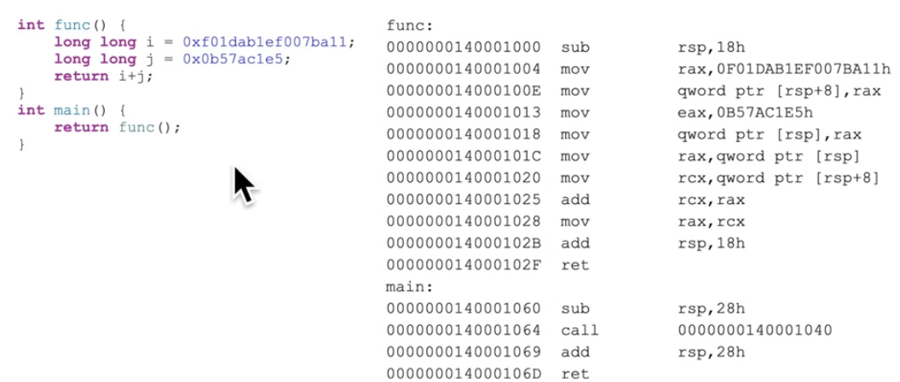
```
14fe08 : 1'40001389
14fe00 : 16-byte-stack-alignment padding
14fdf8 :
14fdf0 :
14fde8 :
14fde0 :
14fdd8 : 1'40001069
14fdd0 : 16-byte-stack-alignment padding
14fdc8 : 0f01dabl'ef007a11
14fdc0 : 00000000'b57ac1e5 -> do chỉ ghi vào `eax` rồi sau đó từ `eax` ghi lại
```
## Excersise TripleLocalVariable.c
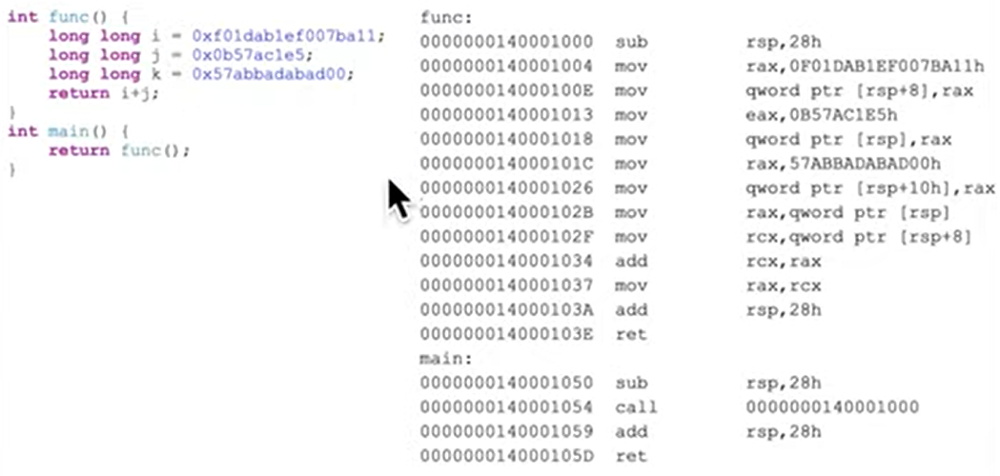
```
14fe08 : 1'40001389
14fe00 : 16-byte-stack-alignment padding
14fdf8 :
14fdf0 :
14fde8 :
14fde0 :
14fdd8 : 1'40001000
14fdd0 : 16-byte-stack-alignment padding
14fdc8 : 
14fdc0 : 00057abb'adabad00
14fdb8 : f01dab1e'f007ba11
14fdb0 : 00000000'b57ac1e5
```
## Excersise ArrayLocalVariable.c
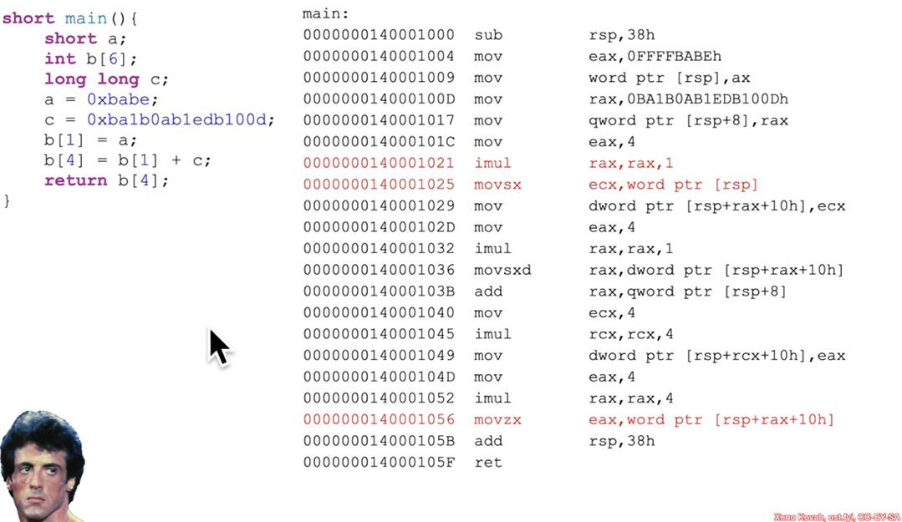
```
14fe08 : 1'40001389
14fe00 : 
14fdf8 :
14fdf0 : xxxxxxxx'1edacacb
14fde8 : 
14fde0 : ffffbabe'xxxxxxxx
14fdd8 : 0ba1b0ab'1edb100d
14fdd0 : xxxxxxxx'xxxxbabe
```
### Solution
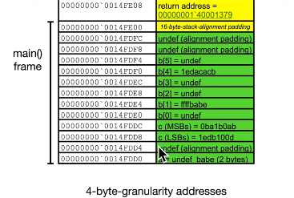
## Excersise StructLocalVariable.c
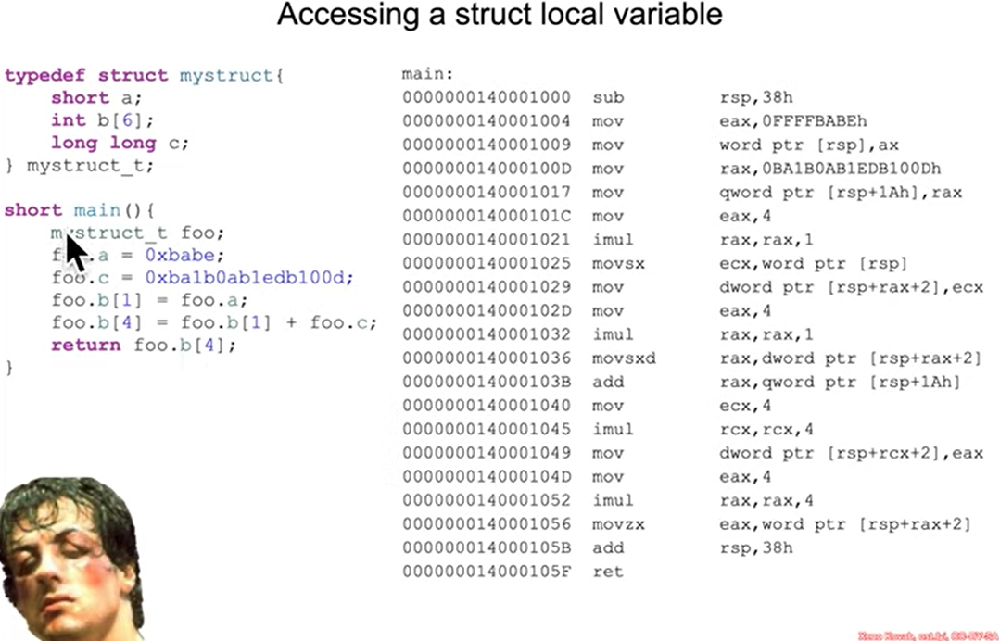
```
14fe08 : 1'40001389
14fe00 :
14fdfc :
14fdf8 : 
14fdf4 : 
14fdf0 : xxxx'0ba1
14fdec : b0ab'1edb
14fde8 : 100d'xxxx
14fde4 : xxxx'1edb
14fde0 : cacb'xxxx
14fddc : xxxx'xxxx
14fdd8 : xxxx'ffff
14fdd4 : babe'xxxx
14fdd0 : xxxx'babe
bytes  : 3 2  1 0  (lsb on the right)
```
### Solution
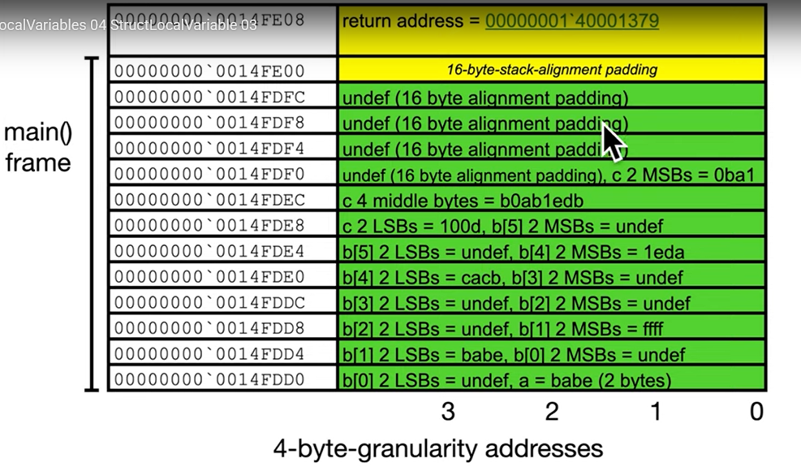
## Excersise

### Solution

## Takeaways
- `local variable` lead to an allocations of space on the stack, within the function where the variable is scoped to.
- `0x18` reversed for only `0x4` (int) worth of data.
- Visual Studio over-allocating space for a single local variable 
- Địa chỉ của `stack pointer` phải luôn chia hết cho 16, do đó, khi thực hiện các lệnh `call`, CPU tự động đẩy 8 byte return address vào `stack frame` làm `stack pointer` bị lệch, do đó tại đầu mỗi hàm, luôn có lệnh `sub rsp, x` để dịch chuyển `rsp` đi một số `x` sao cho kết quả cuối cùng chia hết cho 16 (tức địa chỉ luôn có giá trị cuối cùng bằng 0, theo hệ hex). Lí do cho việc `rsp` phải luôn chia hết cho 16 là vì các CPU hiện đại bây giờ thường gộp nhiều dữ liệu lại trong một lệnh (SIMD - Single Instruction, Multiple Data) bằng các thanh ghi đặc biệt - XMM Registers từ `xmm0` đến `xmm15` có kích cỡ 16 bytes. Do đó, để chuyển dữ liệu vào trong các thanh ghi 16 bytes này thì cần memory address phải chia hết cho 16.
- `imul` (signed multiply) Visual Studio have a predilection for imul over mul 
    - 3 forms:
        1. `imul r/mX` $\to$ `rdx:rax = rax * r/mX`
        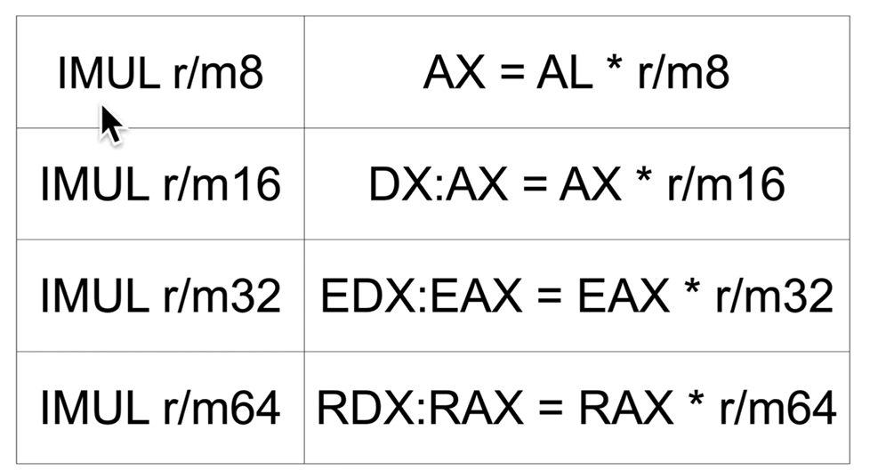
        **Example.**
        `al` is 1 byte register stored 1 byte LSB (in this situation is `0x77 = 01110111b = 119 in decimal`) of `rax` register. `imul r12b` $\to$ `r12b` is a 1 byte register stored 1 byte LSB of `r12` register. In this situation, it holds the value of `0x84 = 10000100b` which is a negative value, change this value to 2's complement by reverse bits (`01111011b`) and then increase 1 value (`01111100b = 0x7c = 124 in decimal`), which means `-124` in decimal. `119` of `al` multiple with `-124` of `r12b` result to `-14756`, the hex value of `14756` is `0x39a4` and to represent the negative value `-14756` in 2's complement, reverse bit from `0011 1001 1010 0100b` to `1100 0110 0101 1011b` and increase it 1 value to get `1100 0110 0101 1100b = 0xc65c`.
        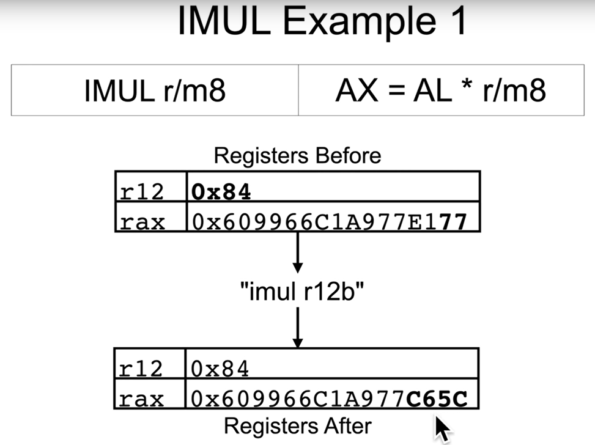
        2. `imul reg, r/mX` $\to$ `reg = reg * r/mX`
        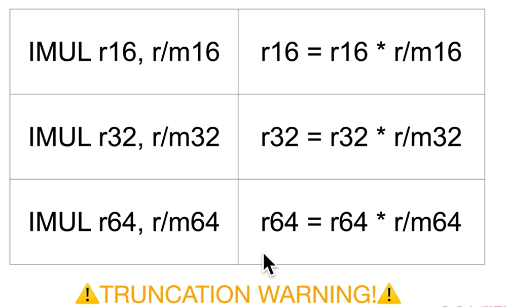
        **Example.**
        The real result is `0x5761d0415c` but it truncates into `0x61d0415c`
        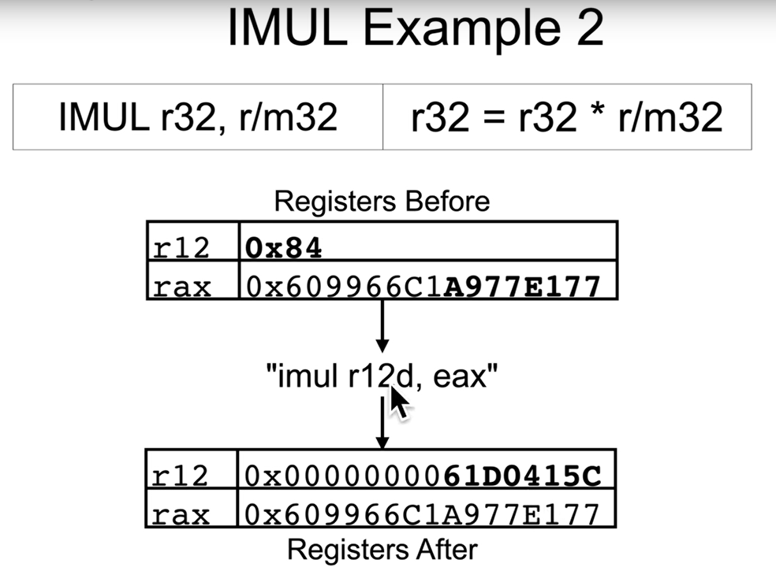
        3. `imul reg, r/mX, immediate` $\to$ `reg = r/mX * immediate`
        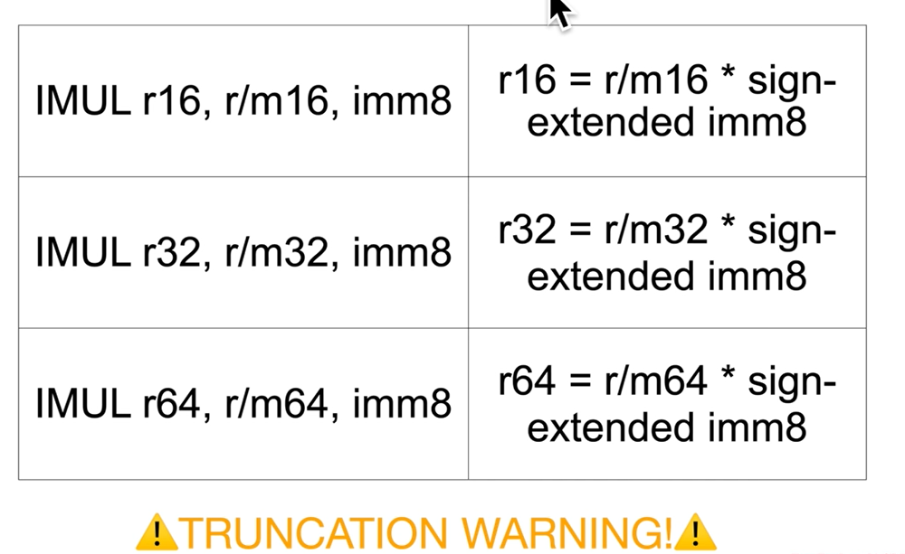
        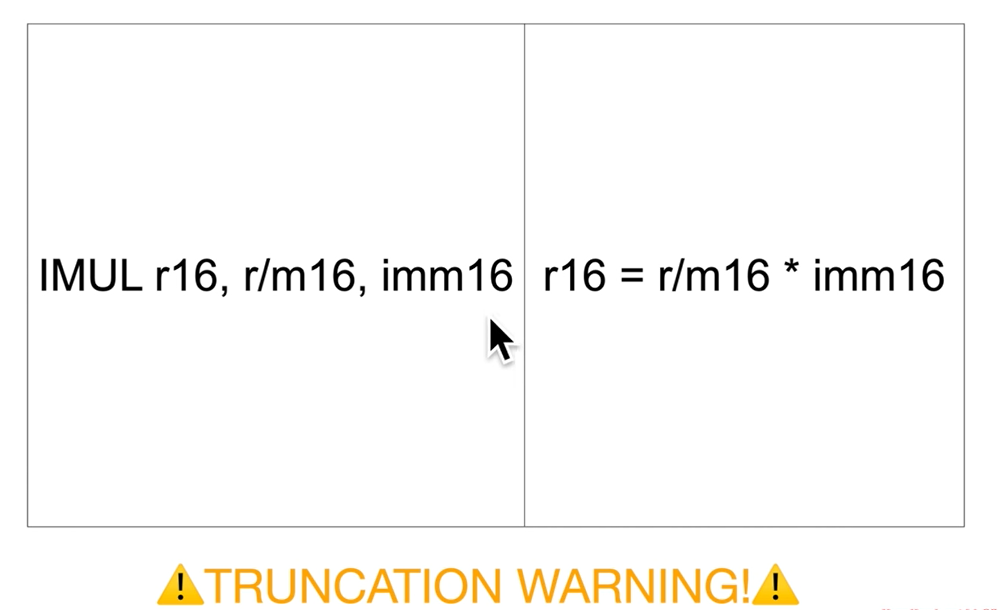
        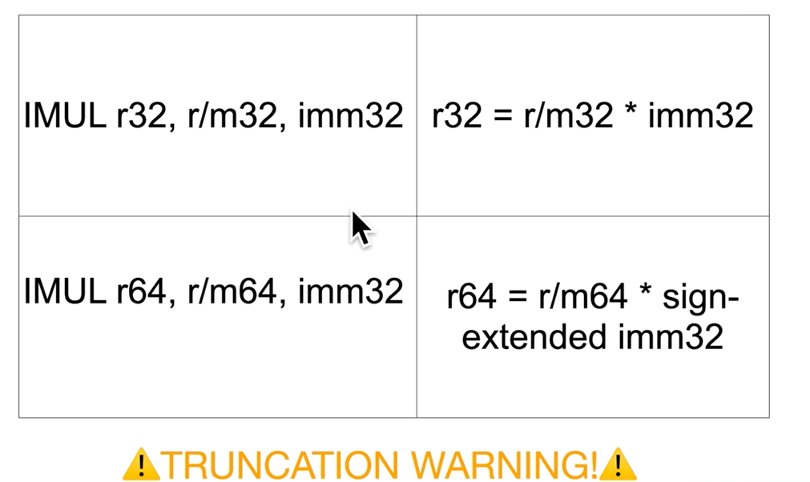
        **Example.**
        `609966c1a977e177 * 12341234 = e5a3577504602a2c`
        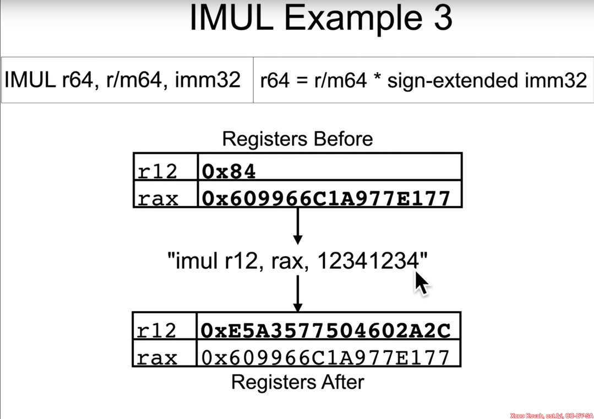
- `movsx` (move with signed extension) and `movzx` (move with zero extension) both used to move small values (from smaller types) into larger registers (holding larger types), zero extend means the CPU unconditionally fills the high order bits of the larger register with zero, signed extend means the CPU fills the high order bits of the destination larger register with whatever the sign bit is set to on the small value. For examples, if I have 0xFF from 8 bits register, and I move it to 16 bits register with zero extend, it will be 0x00FF and if I move it to 16 bits register with signed extend, it will be 0xFFFF.
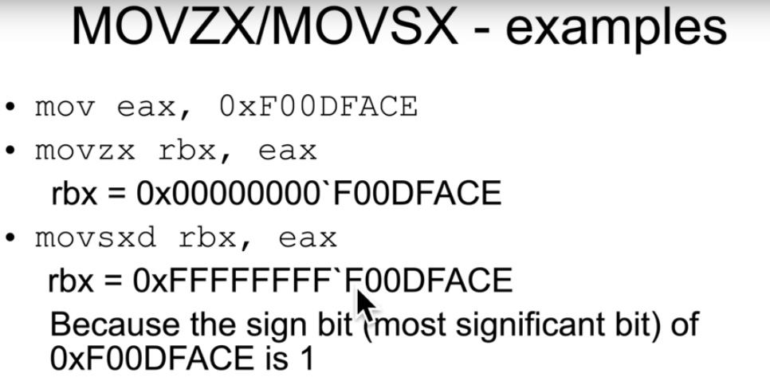
- `local variable` không nhất thiết phải lưu trong stack frame theo cùng thứ tự được khai báo tại ngôn ngữ lập trình bậc cao của nó. 
- Trong Visual Studio ở chế độ unoptimization, truy cập mảng thường sẽ được thực hiện thông qua việc nhân kích cỡ một phần tử của mảng (trong ví dụ trên là `int` tức 4 bytes) với index muốn access (trong ví dụ trên là 1 và 4).
- Khi chuyển giá trị bé vào một thanh ghi lớn hơn giá trị đó sẽ dẫn đến việc zero extend, phép cộng sử dụng số có dấu có thể dẫn đến sign extend nếu phép tính đó được thực hiện tại một thanh ghi lớn hơn giá trị biểu diễn.
- `little endian` when stores value in memory, but `big endian` when represent value in assembly code because it is human-readable form.
- các `attributes` trong `struct` phải được lưu trữ theo đúng thứ tự được định nghĩa trong struct đó tại high level language, do đó, `attribute` trên cùng sẽ có địa chỉ thấp nhất và các `attributes` sau sẽ nằm ở vị trí cao hơn.