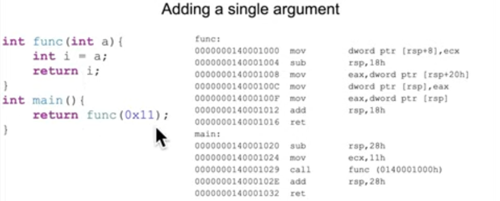
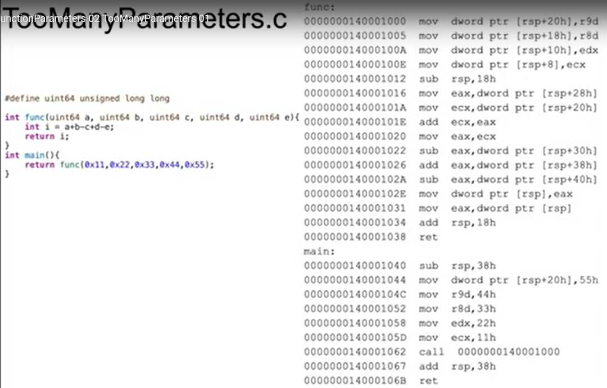
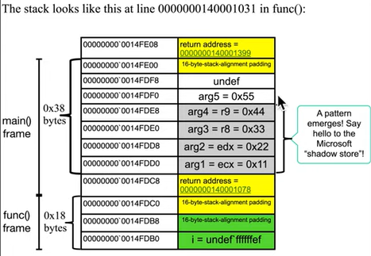
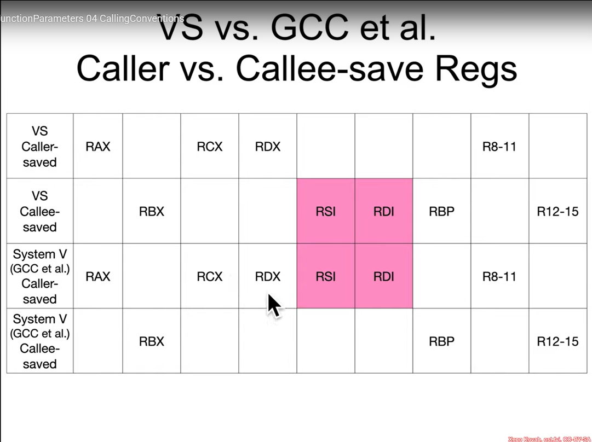
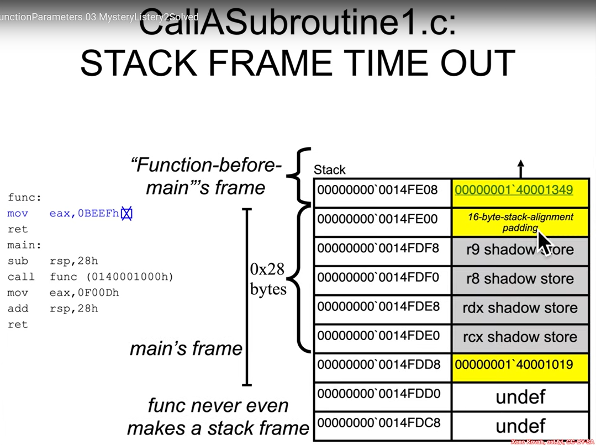
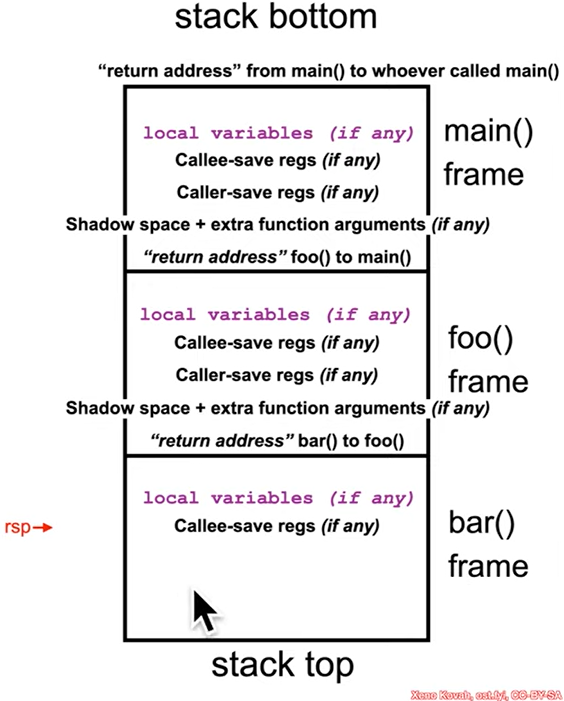
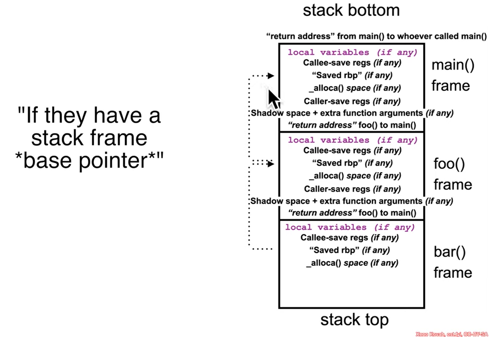
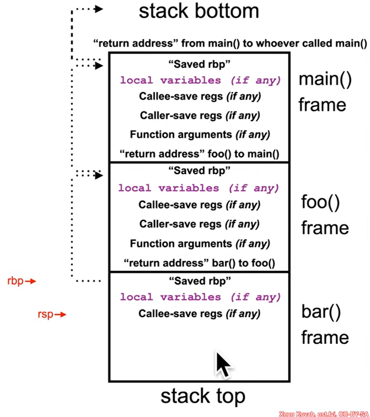

## Excersise

### Solution
```
14fe08 : 1'40001389
14fe00 : 
14fdf8 :
14fdf0 : 
14fde8 : 
14fde0 : 00000000'00000011
14fdd8 : 1'4000102e
14fdd0 : 
14fdc8 :
14fdc0 : 00000000'00000011
```
```
ecx : 11h
eax : 11h
```

## Excersise

### Solution
```
14fe08 : 1'40001389
14fe00 : 
14fdf8 :
14fdf0 : 0x55
14fde8 : 0x44
14fde0 : 0x33
14fdd8 : 0x22
14fdd0 : 0x11
14fdc8 : 1'40001000
14fdc0 : 
14fdb8 : 
14fdb0 : xxxxxxxx'ffffffef
```
```
eax : 0x22
ecx : 0x11
r9d : 0x44
r8d : 0x33
edx : 0x22
```

## Calling Conventions
- calle-save registers will typically save volatile registers (e.g register `rax`, `rcx`, `rdx`, `r8`, `r9`, `r10`) right before the call and restore right after the call
- callee-save registers will typically save non-volatile registers (e.g register `rbx`, `brp`, `bdi`, `rsi`, `r12` - `r15`) at the beginning of the function and restore at the end of the function.

- volatile register is like a "scratch paper", used for temporary math,...non volatile register is for "long-term storage", used for variables that needs to be survived accross many function calls
- Microsoft x86-64 ABI used rax (and maybe rdx for 128-bit in `System V`) for passing out the return value
- Compiler used fast call registers first for storing parameter, remaining parameters pushed onto the stack so that the left-most parameter is at the lowest address
- `System V` x86-6 ABI (`GCC`) used 6 fast call register included `rdi`, `rsi`, `rdx`, `rcs`, `r8`, `r9`

## lea - Load Effective Address
- Sử dụng cho pointer arithmetic hoặc arithmetic nói chung
- Sử dụng `mX` form (chính xác là chỉ sử dụng phần `m` trong `r/mX`), nhưng là ngoại lệ cho quy tắc `[]` biểu thị cho dereference. Cụ thể, `rbx = 0x2`, `rdx = 0x1000` thì lệnh `lea rax, [rdx+rbx*8+5]` sẽ cho ra kết quả `rax = 0x1015` thay vì `rax` bằng giá trị tại `0x1015`.
- Lệnh này giúp máy tính thực hiện tính toán nhanh hơn so với việc sử dụng `imul`

## Takeaway
- Ngày xưa, tại kiến trúc 32 bit x86, mọi tham số được đẩy vào `stack` (tức là `RAM`), tuy nhiên `RAM` vẫn chậm (nếu so với `register`). Do đó, `fast call` được sử dụng, quy định CPU phải sử dụng 4 `register` để lưu 4 tham số đầu tiên bao gồm thứ tự như sau: `rcx`, `rdx`, `r8`, `r9`. Tại `caller function`, nó không lưu các tham số vào `shadow store` mà chỉ đơn giản là reserve 32 bytes of empty stack space (the `shadow`, và nó sẽ luôn luôn reserve 32 bytes này kể cả có sử dụng tham số hay không), sau đó lưu giá trị của parameter vào `register` và thực hiện lệnh `call`. `Empty space` này tồn tại cho `callee function` (the function being called), nếu `callee function` hết `register` hoặc muốn sử dụng các fast call `register` cho việc tính toán thì `callee function` sẽ copy giá trị từ thanh ghi ra các `shadow store` đã reserver từ bước trên. Mọi tham số từ tham số thứ 5 trở đi (vượt quá 4), sẽ được lưu tại vùng nhớ stack ngay sau `shadow store` (nhìn solution của excersise toomanyparameter.c là hiểu).
- Do compiler của Visual Studio sẽ luôn reserve 32 bytes of empty stack space cho 4 fast call register, do đó kể cả khi không sử dụng tham số nào, stack frame vẫn chứa 32 bytes cho fast call register. Các caller function luôn luôn sẽ có dòng `sub rsp, 28h` hoặc lớn hơn `28h` vì lí do này. Ví dụ về việc reserve 32 bytes như sau:


- `System V` isn't a compiler, it is a set of rules (an ABI - Application Binary Interface), that compilers like `GCC` and clang follow on Linux and Unix systems. When `GCC` and Clang compile for Windows (usually via MinGW-w64 or `Cygwin`) it switches rules and uses Microsoft x64 Calling Convention (the same with Visual Studio uses). `System V` and Microsoft x64 have different ABI so that the assembly commands will be different.
- `MinGW64-w64` stands for `Minimalist GNU for Windows`. It is a version of the `GCC` compiler that has been modified for Windows. It let you compile C/C++ code on Windows and create native Windows programs and can run on any Windows machine without needing extra installation. MinGW use `Microsoft x64 ABI`.
- `Cygwin` is a Compatibility Layer or Simulator that trick Linux programs into thinking they are running on Linux, but in fact they are running on Windows. The purpose of `Cygwin` is to bring the entire Linux environment (bash, ls, grep, fork) to Windows. Internally, it uses `Microsoft x64 ABI` but it provides a fake `System V` feeling for developers. Because it is a simulator, so programs compiled with `Cygwin` cannot run alone, and they requires a huge file called `cygwin1.dll`
- 64-bit maximum stack diagram in Visual Studio (which use Microsoft x64 ABI)

- 64 bit mamixum stack diagram in Visual Studio++

- 64 bit maximum stack diagram in `System V`
