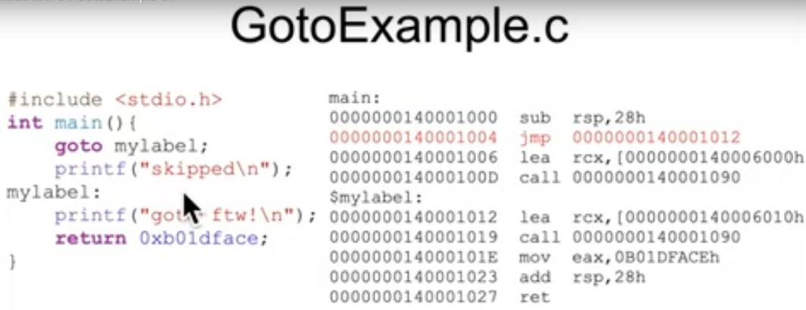
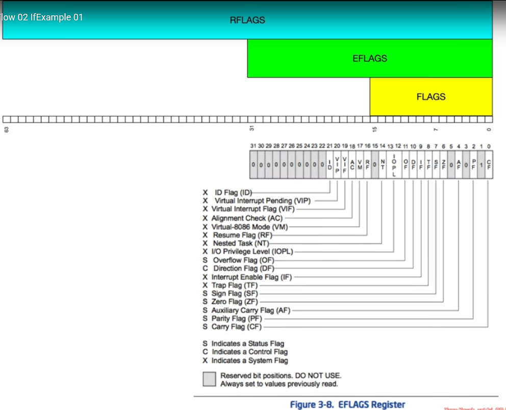
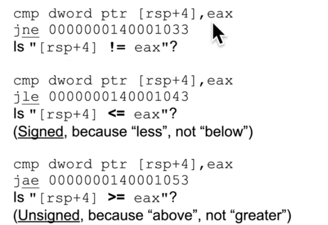
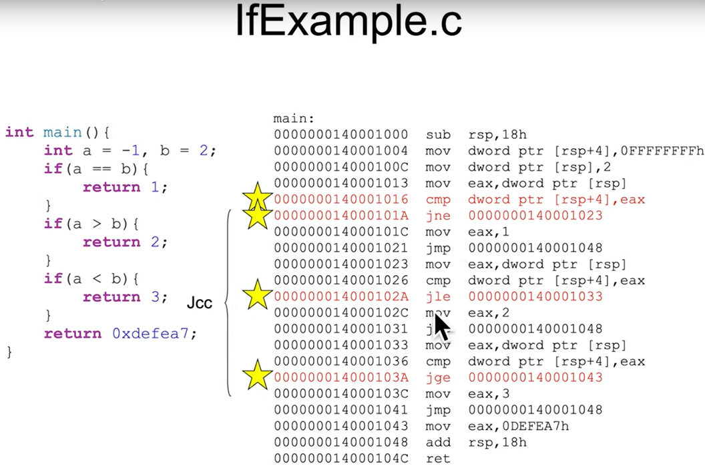
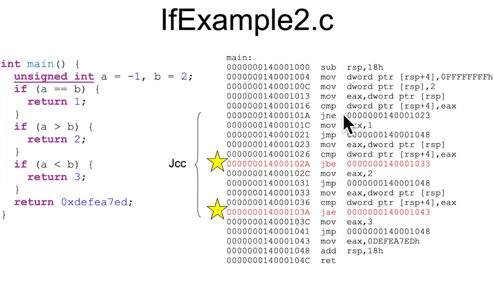
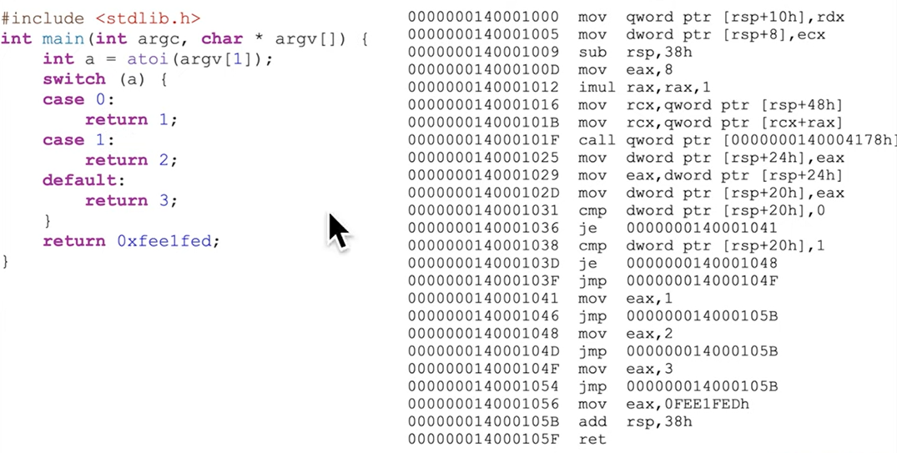

## Control Flow
- 2 forms: conditional (`if`, `switches`, `loops`) and unconditional (`calls`, `goto`, `exceptions`, `interrupts`)
### jmp - Jump
- Change rip to given address
- goto in high level programming language is jmp in assembly
- 2 cách xác định địa chỉ:
    - short, relative (rip = rip of the next instruction + 1 bytes sign-extended-to-64-bits displacement): Lệnh jmp không chỉ thị phải di chuyển đến địa chỉ nào mà sẽ chỉ nói rằng tiến lên hoặc lùi x bytes. Trong trường hợp này, khoảng cách để nhảy (tức tham số x để tiến/lùi) được lưu trong 1 bytes, tức là chỉ được di chuyển về sau 128 bytes (tức -128) hoặc tiến về trước tối đa 127 bytes (tức +127). Một vài công cụ disassembler thêm từ khóa short ngay sau lệnh jmp để kí hiệu rằng đây là jmp 1 bytes giúp người đọc dễ hiểu. 
    - far, absolute indirect: 
    - near, relate (rip = rip of the next instruction + 1 bytes sign-extended-to-64-bits displacement):
    - near, absolute indirect (address calculated with r/m64):
#### Excersise GotoExample.c

```
14fe08 : 1'40001389
14fe00 : 
14fdf8 :
14fdf0 :
14fde8 :
14fde0 : 
14fdd8 : 1'40001006
```
```
rip: 
rcx: 1'40006010h
eax: b01d'faceh
rcx: 1'40006000h

```
#### Solution
### jcc - Jump If Condition Is Met
- If the condition is true, the jump is taken. Otherwise it proceeds to the next intruction.
### cmp - Compare Two Operands
- The comparision is performed by subtracting the second operand from the first operand and then setting the status flags in the same manner as the SUB instruction. But the difference is that with SUB instruction, the result has to be stored somewhere, but this command doesn't.
- cmp instruction, most of the time, go along with jump instruction because cmp will update status flags for jump instruction. So if sub, add,...command (not mov, lre) has already updated the status flag, developers dont need to add cmp command anymore.

### RFLAG Special Register

- `rflags` is a special register holding many single bit flags. 2 bit flags have to know is zero flag (zf) and sign flag (sf), other flags will be optional. Zero Flag is set to 1 if the result of some instruction is zero, clear otherwise. Sign Flag is set to the most significant bit of the result, which is the sign bit of a signed integer (0 for positive and 1 for negative).
- above and below is for unsigned, greater and less than is for signed.

#### Example

#### Excersise IfExample.c

#### Excersise IfExample2.c

#### Excersise SwitchExample.c
 
### Takeaway
- Because there are different conditions for unsigned and signed, which leads to different assembly instruction for unsigned and signed comparision, which implies the compiler emits different code depending on whether the programmer declared variables as unsigned or signed, so as a reverse engineer, can use this to infer whether variables are likely unsigned or signed.
- The hardware (or specifically CPU) doesn't care about the number is signed or not, bit are just bit. So that, CPU will calculate the flags for both possibility simultaneously, the the compiler will decide which flags to look at based on the C code. Cụ thể cần flag nào thì tra cứu lại, chứ giờ nhớ không nổi 🫠.
    For instance, `cmp al, bl`, CPU does the math and sets `CF = 1` because unsigned overflow and `OF = 0` because signed is fine. In C code, if I declare a and b is usigned int, then I compare `if (a > b)`, compiler will generate `JA` for jump above and looks at the CF flags. Otherwise, if a and b is int, compiler will generate `JG` for jump greater and looks at `SF` and `OF` flags.