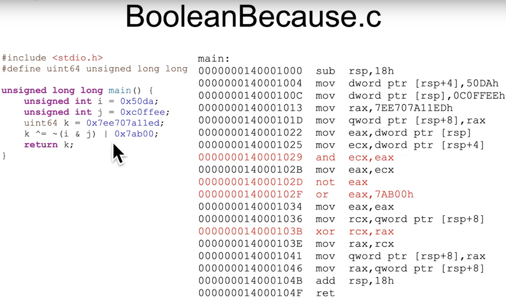
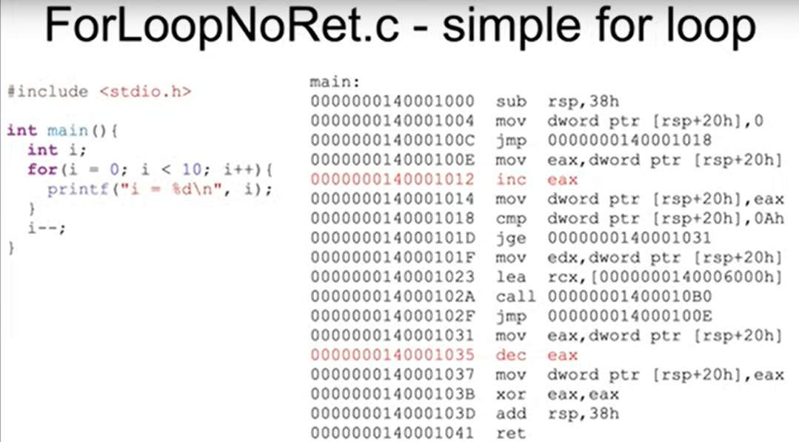
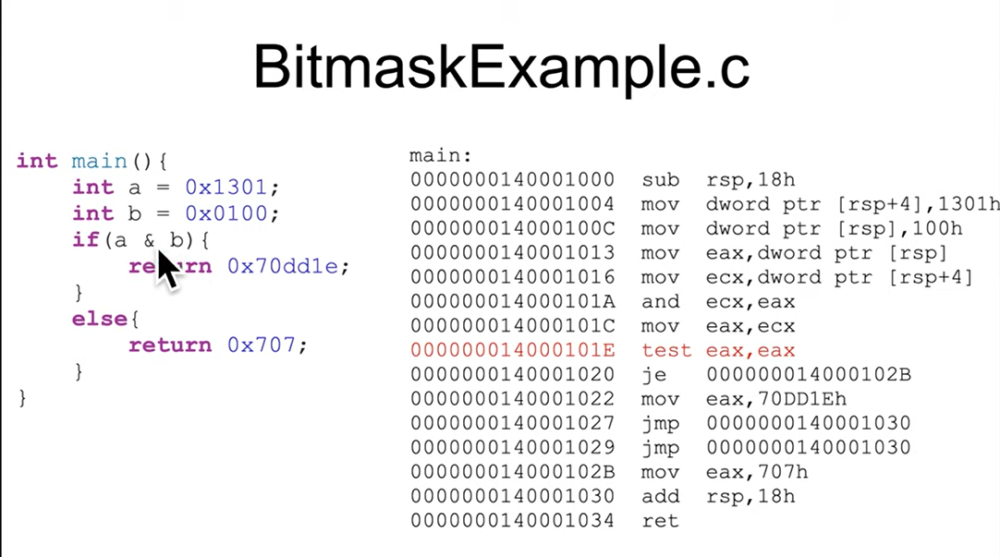

## Boolean Instruction: and, or, not, xor
- boolean operations modify most of status flags
- bitwise operator is different with local operator
- destination operand can be `r/mX` or register, source operand can be `r/mX` or register or immediate
- `xor` is commony used to zero a register by xoring it with itself because it's faster than mov
## Instruction: inc, dev
- `inc`/`dec` will increase increase/decrease the value by 1. When optimized, compilers will tend to favor not using `inc`/`dec`, as directed by the Intel optimization guide. So their presence may be indicative of hand-written, or un-optimized code. These two commands will also modify `OF`, `SF`, `ZF`, `AF`, `DF` and `CF` status flag.

## Instruction: test (Logical Compare)
- `test` command computes the bit-wise `AND` of first operand and the second operand and sets the `SF`, `ZF` and `PF` status flags according to the result, like `cmp`.
### Excersise BooleanBecause.c

### Excersise ForLoopNoRet.c
- Trong ví dụ này, hàm `main` không sử dụng return nên tại cuối assembly, compiler sử dụng `xor eax, eax` để ghi đè giá trị của `eax` thành 0 và sẽ return 0

### Excersise BitmaskExample.c
- The unreachable jump is because it's unoptimized code so the compiler is following a simpler set of asm construction rules.
