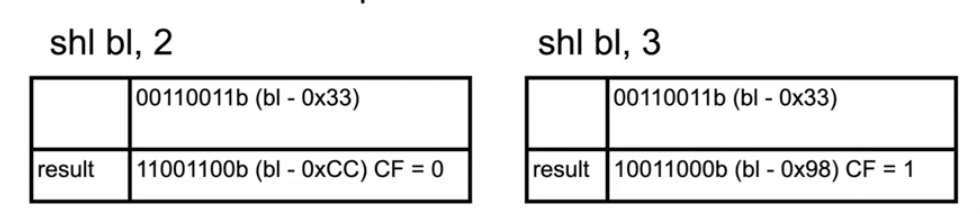
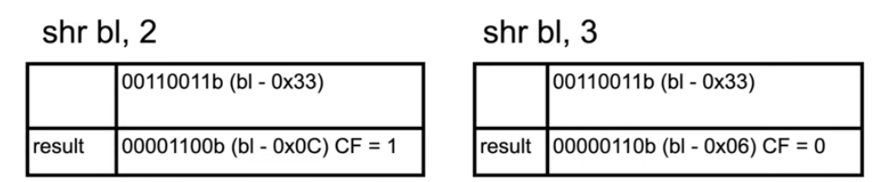
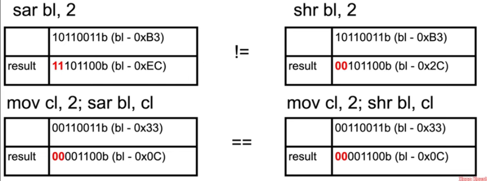
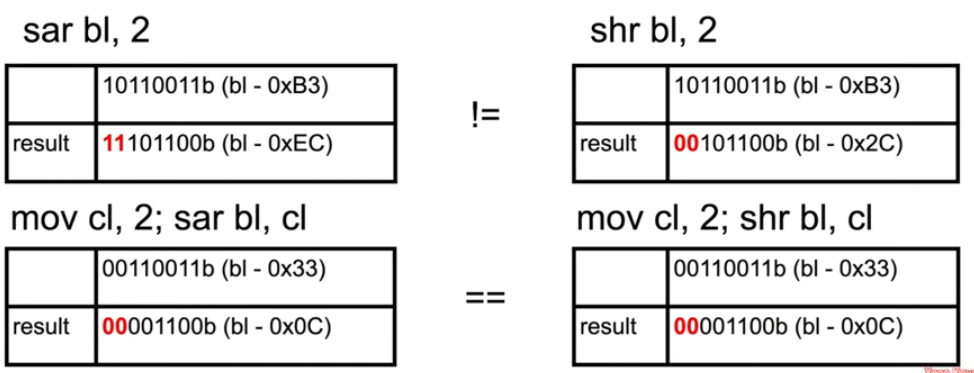

## Instruction: shl, shr

- `shl` (shift logical left), first operand is an `r/mX`, second operand is either `cl` (lower byte of `rcx`) or a 1 byte immediate, bits shifted off the left hand side are "shifted into" (set) the carry flag (`CF`)
- shr (shift logical right), first operand is an `r/mX`, second operand is either `cl` (lower byte of `rcx`) or a 1 byte immediate, bits shifted off the right hand side are "shifted into" (set) the carry flag (`CF`)
- shifting left and right is more efficient than multiplying and dividing by a power of two
  
  

## Instruction: sar, sal

- used when the operands are signed rather than unsigned
- sar (shift arithmetic right), first operand is an `r/mX`, second operand is either `cl` (lower byte of `rcx`) or a 1 byte immediate, bits shifted off the right hand side are "shifted into" (set) the carry flag (`CF`)
  
- sal (shift arithmetic left) actually behaves exactly the same as shl
  
