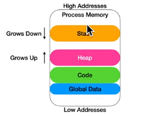

## The Stack 
- `stack` là một khu vực "trừu tượng" nằm trong RAM mà OS cấp phát cho một chương trình khi chương trình đấy chạy. Tùy hệ điều hành và có sử dụng address space layout randomization (ASLR) hay không mà `stack` sẽ bắt đầu tại những vị trí khác nhau.

- `RSP` trỏ đến đầu của `stack` tức nơi có địa chỉ bé nhất, những giá trị nào nằm ngoài khoảng xác định sẽ được coi là `undefined`
- những thông tin có thể tìm thấy trong `stack`: `return addresses`, `local variable`, truyền `argument` giữa các `functions`, cấp phát động thông qua `alloca()`, tiết kiệm không gian cho `register`.
