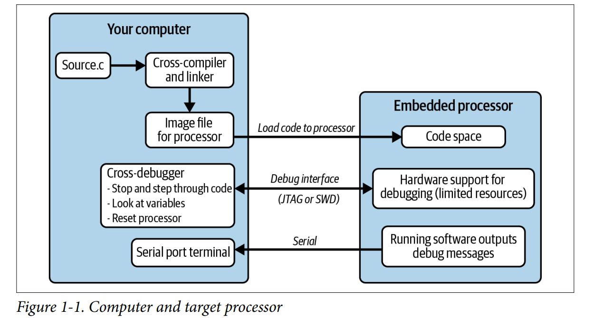

### C1. Introduction
- An embedded system is a computerized system that is purpose-built for its application.
- The hardware of an embedded system often has constrains, for examples, a CPU that runs slower to save battery power.
- In some systems, the software must act deterministically (act exactly the same each time) or in real time (always reacting to an event fast enough), for examples, a satellite or a heart monitor.
- Embedded systems use cross-compilers. Many larger processors use the cross-compilers from the GNU family of tools such as GCC.
- Embedded systems use cross-debugger. The debugger sits on your computer and communicates with the target processor through a special processor interface. The interface is dedicated to letting someone else eavesdrop on the processor as it works. This interface is often called JTAG.
- The processor must expend some of its resources to support the debug interface, allowing the debugger to halt it as it runs and providing the normal sorts of debug information. Supporting debugging operations adds cost to the processor.
- However, if your code is executing out of flash (or any other sort of readonly memory), instead of modifying the code, the processor has to set an internal register (hardware breakpoint) and compare it at each execution cycle to the code address being run, stopping when they match. Internal registers take up resources, too, so often there are only a limited number of hardware breakpoints available (frequently there are only two).

- Creating a system that can be manufactured for a reasonable cost is a goal that both embedded software engineers and hardware engineers have to keep in mind.
#### Principles to Confront Those Challenges
- Flexibility is not just about what the code can do right now, but also about how the code can handle its life-span.
- Using modularity, we separate the functionality into subsystems and hide the data each subsystem uses. With encapsulation, we create interfaces between the subsystems so they don’t know much about each other.
- Document what the code does, not how it does it.
- Because you have limited amount of time, implement the features, make them work, test them out, and then make them smaller or faster as needed. Looking for the bigger resource consumers after you have a working subsystem. We should forget about small efficiencies, say about 97% of the time: premature optimization is the root of all evil.
#### Further Reading
- Design Patterns: Elements of Reusable Object-Oriented Software.
- Head First Design Patterns.
- Prototype to Product: A Practical Guide for Getting to Market
#### Interview Question: Hello World
Question: Here is a computer with a compiler and an editor. Please implement "hello world." Once you have the basic version working, add in the functionality to get a name from the command line. Finally, tell me what happens before your code executes, in other words, before the main() function.
Hints:
- Use specific language (normally C and C++), header file to include and command argument. Have the ability to find and fix syntax error based on compiler errors.
- Mention about the program requires initialization likes settings the exception vectors to handle interrupts, init critical peripherals, init stack, init variables, calling global constructors (in C++ objects). Great if can describe what happens implicitly by the compiler and what happens explicitly (in initialization code).
- Bonus points is discussion of power-on behavior, explain why an embedded system can't be up and running 1 microsecond after the switch is flipped, understanding of power sequencing, power ramp-up time, clock stabilization time and processor reset/initialization deplay.
Answer:
- Initialize vector table for interrupt handling and reset vector.
- Initialize critical peripherals.
- Initialize stack.
- Initialize variables (initialized variables will be copied from flash to RAM, uinitialized or static variable will be assigned 0).
- Calling constructor (if the programming language is C++).
Bonus (Power-on behavior):
- Power sequencing: stablize source voltage.
- Power ramp-up time: How long does it take to get operating voltage.
- Clock stabilization:
- Processor reset/initialization delay: self reset and ready to execute the first command.

### C2. Creating a System Architecture
