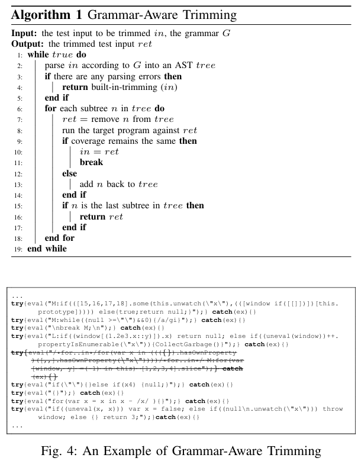
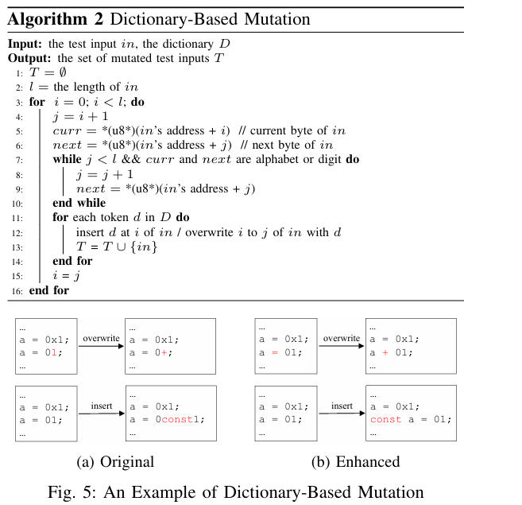
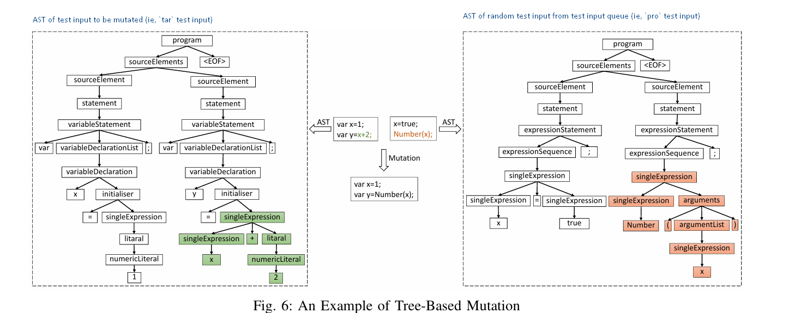

Superion

- Bài báo này thực nghiệm với định dạng XML và JavaScript chứ không thực nghiệm với PDF, PNG,...
- Làm sao có thể cắt bớt một phần input mà coverage vẫn giữ nguyên? hay phần bị cắt bớt là phần rất ít khi (hoặc thậm chí là không bao giờ) được gọi?

Mục tiêu:

1. đề xuất một grammar-aware coverage-based greybox fuzzing với việc thêm đầu vào là grammar trong quá trình trim test input.
2. đề xuất một grammar-aware trimming strategy (chắc là nghĩa hẹp hơn so với mutation strategy) ở tree level bằng cách sử dụng abstract syntax trees (ASTs) của các đầu vào đã được phân tích, với điều kiện là định dạng/cú pháp đầu vào được cho trước (thường là sẽ public cái này)
3. đề xuất hai grammar-aware mutation strategies, bao gồm enhanced dictionary-based mutation và tree-based mutation. Trong đó, tree-based mutation hoạt động dựa trên nguyên lý thay thế những subtrees sử dụng ASTs của các đầu vào đã được phân tích.

Cụ thể:

1. Grammar-Aware Trimming Strategy
   
   Trong trimming strategy của AFL, nó sẽ chia test input thành những chunk có độ dài là len/n với len là chiều dài của toàn bộ test input và n là bội số của 2 bắt đầu từ 16 đến 1024. Nếu coverage dữ nguyên sau khi loại bỏ chunk nào đó, thì chunk đó sẽ thực sự bị lược bỏ. Mục đích của việc trimming này là giữ test input càng ngắn càng tốt mà vẫn duy trì coverage để đảm bảo hiệu suất.
   Thuật toán 1. Chuẩn bị grammar cho định dạng file (gọi là G) và test input (gọi là in)
   Bước 1. Thử Phân tách test input thành AST tree dựa trên grammar của định dạng file đầu vào.
   Bước 2.1. Nếu quá trình phân tách thành AST tree gặp lỗi, thực hiện trimming theo chunk như của AFL.
   Bước 2.2. Nếu quá trình phân tách thành AST tree thành công, thử cắt một subtree trong AST tree. Nếu sau khi cắt subtree này mà coverage thay đổi so với trước lúc cắt, subtree này không thể được cắt mà sẽ thực hiện thử cắt subtree khác cho đến khi coverage không thay đổi thì mới thực hiện cắt thật.
   Bước 3. Lặp lại bước 1 cho đến khi nào không thể cắt subtree nào khỏi test input nữa thì thôi. Chú ý rằng chỉ sử dụng phương pháp trimming mặc định của AFL khi mà phương pháp trimming dựa trên AST này không áp dụng được nữa mà thôi.
2. Grammar-Aware Mutation Strategies
   
   2.1 Enhanced Dictionary-Based Mutation
   `Dictionary` là một danh sách các từ khoá (như trong C có `void`, `int`,...) được cung cấp bởi người dùng hoặc AFL tự động xác định.
   Thuật toán 2. Tận đặc điểm của các từ khoá trong một test input thường chỉ bao gồm chữ cái hoặc chữ số.
   Bước 1. Duyệt từng byte của test input, xác định những chuỗi byte liền kề nhau có cùng kiểu dữ liệu là alphabet hoặc digit.
   Bước 2. Thay thế nội dung của byte đầu tiên trong chuỗi vừa tìm được hoặc ghi đè toàn bộ chuỗi byte liền kề đấy bằng từ khoá trong dictionary list.
   Bước 3. Thêm test input vừa được mutate đấy vào input queue rồi quay lại bước 1.
   2.2 Tree-Based Mutation
   AST mô hình test input bằng các objects với nhiều thuộc tính bên trong, đủ để biểu diễn được toàn bộ thông tin của test input.
   Thuật toán 3. Đầu vào là test input chuẩn bị được mutate gọi là `tar`, văn phạm `G` và một test input chọn ngẫu nhiên gọi là `pro` trong test input queue.
   Bước 1. Trích xuất `tar` dựa trên văn phạm `G` để ra được AST `tar_tree`, nếu xảy ra lỗi trong quá trình trích xuất, không áp dụng phương pháp tree-based mutation nữa.
   Bước 2. Nếu không xảy ra lỗi, thực hiện duyệt tuần tự `tar_tree` và lưu các subtree trong một cấu trúc dữ liệu set đặt tên là `S`.
   Bước 3. Tương tự, trích xuất `pro` dựa trên văn phạm `G` để được `pro_tree`, nếu không có lỗi gì xảy ra thì tương tự, lưu các subtree tạo được từ `pro_tree` vào lại tập `S` ở Bước 2.
   Bước 4. Tại đây, `S` đóng vai trò là content provider cho việc mutate, lần lượt thay thế các subtree trong `tar_tree` bằng các subtree được lưu trong tập `S` để tạo tập các mutate input mới.
   Tuy nhiên, việc thực hiện thay thế toàn bộ các subtree thế này sẽ làm tăng kích cỡ và việc fuzzing kém hiệu quả. Do đó, nhóm tác giả đề xuất thiết kế 3 phương pháp mới để giảm kích cỡ mutated test inputs.
   
   Phương pháp 1. Giới hạn kích cỡ của test inputs.
   Giới hạn kích cỡ của `tar` và `pro` không vượt quá 10000 bytes vì kích cỡ test input càng dài, càng nhiều subtree, càng nhiều tổ hợp có thể tạo ra và đồng thời kích cỡ test input càng lớn, chương trình chạy càng lâu
   Phương pháp 2. Giới hạn số lần thực hiện mutate
   Nếu trong tập `S` có nhiều hơn 10000 subtrees, thực hiện chọn ngẫu nhiên chỉ 10000 subtrees thôi.
   Phương pháp 3. Giới hạn kích cỡ của subtree
   Giới hạn độ dài của subtrees trong tập `S` là 200 bytes vì theo tác giả, đây là đồ dài đủ để tạo các câu lệnh phức tạp rồi.
