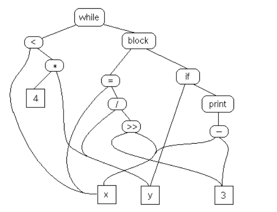
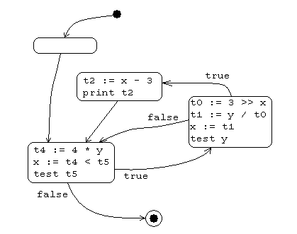

# intermediate representation

Reference: https://cs.lmu.edu/~ray/notes/ir/

`intermediate representation` is a data/model format that sits between an input (e.g., source code or a file format) and an output (e.g., machine code or a transformed file). It preserves the essential meaning while simplifying/standardizing structure so tools can analyze, optimize, or transform it more easily.
Intermediate representations come in many flavors.
The three main ones are:

1. Graph

   ```c++
   while (x < 4 * y) {
       x = y / 3 >> x;
       if (y) print x - 3;
   }
   ```

   The example code fragment above creates a `semantic graph`.
   

2. Tuples
   Here is the tuple representation of the example source code fragment above

   ```
   (JUMP, L2)         //     goto L2
   (LABEL, L1)        // L1:
   (SHR, 3, x, t0)    //     t0 := 3 >> x
   (DIV, y, t0, t1)   //     t1 := y / t0
   (COPY, t1, x)      //     x := t1
   (JZ, y, L3)        //     if y == 0 goto L3
   (SUB, x, 3, t2)    //     t2 := x - 3
   (PRINT, t2)        //     print t2
   (LABEL, L3)        // L3:
   (LABEL, L2)        // L2:
   (MUL, 4, y, t4)    //     t4 := 4 * y
   (LT, x, t4, t5)    //     t5 < t4
   (JNZ, t5, L1)      //     if t5 != 0 goto L1
   ```

   Tuples are instruction-like objects consisting of an operator and zero or more operands (defined above). Because they are intermediate, they can be whatever you want. You can literally make up a set of tuples! For example, `(COPY, x, y)` can be rendered as `y := x`

3. Stack

   ```
   JUMP L2
   L1:
       PUSH y
       PUSHC 3
       PUSH x
       SHR
       DIV
       STORE x
       PUSH y
       JZERO L3
       PUSH x
       PUSHC 3
       SUB
       PRINT
   L3:
   L2:
       PUSH x
       PUSHC 4
       PUSH y
       MUL
       LESS
       JNOTZERO L1
   ```

Each flavor of IR (graph, stack, tuples) processes entities. Each entity in the IR is a bundle of information, which will be used in the later phases of the compiler that generate real target code.
| Entity | Properties | Notes |
|------------|-------------------------------------------|----------------------------------------------------------------------------------------------------------------------------------|
| Literal | value | Integer or floating-point constant. |
| Variable | name<br> type<br> owner | Variable or parameter from the source code. The owner is the function or module in which the variable or parameter was declared. |
| Subroutine | name<br> parent<br> parameters<br> locals | Procedure or Function. |
| Temporary | name<br> type | A temporary variable, generated while creating the IR. |
| Label | name | A label used for jumps. |

An IR should be source language agnostic and target language agnostic.

A `control flow graph` is a graph whose nodes are basic blocks and whose edges are transitions between blocks.

A `basic block` is a:

- maximal-length sequence of instructions that will execute in its entirety
- maximal-length straight-line code block
- maximal-length code block with only one entry and one exit

To locate basic blocks in flattened code:

- Starts with: (1) target of a branch (label) or (2) the instruction after a conditional branch
- Ends with: (1) a branch or (2) the instruction before the target of a branch.

```
goto L2
L1:
     t0 := 3 >> x
     t1 := y / t0
     x := t1
     if y == 0 goto L3
     t2 := x - 3
     print t2
L3:
L2:
     t4 := 4 * y
     x := t4 < t5
     if t5 != 0 goto L1
```

The code above has 3 basic blocks

