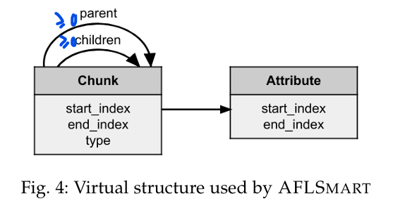
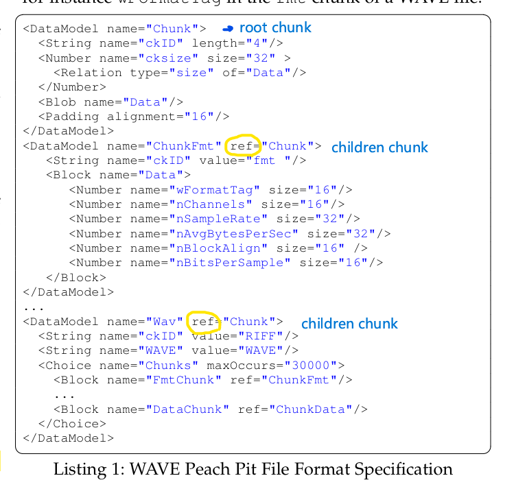
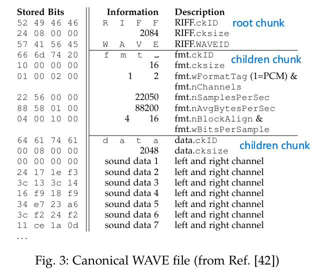

# Smart Greybox Fuzzing

### What

- define innovative mutation operators that work on the virtual file structure rather than on the bit level which allows SGF to explore completely new input domains while maintaining file validity.
- introduce a novel validity-based power schedule that enables SGF to spend more time generating files that are more likely to pass the parsing stage of the program.

### Why

- random bitflips to generate new files are unlikely to produce valid files (or valid chunks in files), for applications processing complex file formats.

### Result

- more branch coverage (up to 87% mprovement) than AFL.
- discovered 42 zero-day vulnerabilities in tools and libraries
- discovered 22 CVEs

### How

#### Virtual Structure

Each input file can be represented as a (parse) tree.The nodes of this tree are called chunks or attributes,
with the chunks being the internal nodes of the tree and the attributes being the leaf nodes of the tree.

A chunk is a contiguous sequence of bytes in the file. Each chunk has a start-and an end-index representing the start and end of the byte sequence in the file, and a type representing the distinction to other chunks (e.g., an fmt chunk is different from data chunk in the WAVE format). An attributes represents important data in the file that is not structurally relevant, for instance wFormatTag in the fmt chunk of a WAVE file.

To construct the virtual structure, a file format specficication and a parser is required.

### Reproduce

### Trades-off

### Improve
