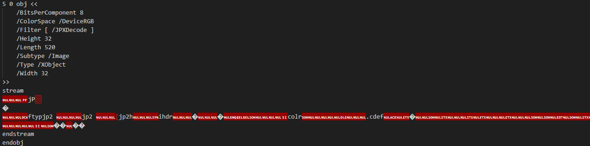
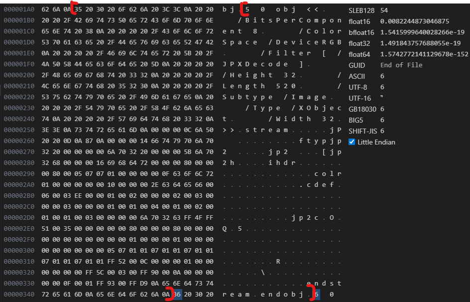
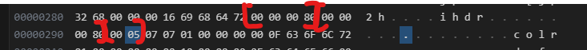
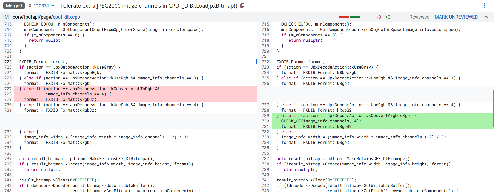

## CVE-2024-7973

### References

CVE Information: https://nvd.nist.gov/vuln/detail/cve-2024-7973
Issue: https://issues.chromium.org/issues/345518608
Commit: https://pdfium-review.googlesource.com/c/pdfium/+/120331

### Description

Heap buffer overflow in PDFium in Google Chrome prior to 128.0.6613.84 allowed a remote attacker to perform an out of bounds memory read via a crafted PDF file. (Chromium security severity: Medium)

### Vulnerability Detail
Tolerate extra JPEG2000 image channels in `CPDF_DIB::LoadJpxBitmap()`
JPEG2000 images can have more color channels than the number of color components. Thus checking for exactly 4 channels may be too strict. In the case where the `JpxDecodeAction::kConvertArgbToRgb` action is in use, remove the channel check when selecting the output image format. Instead, use `CHECK_GE()` to make sure the code that chose to use `kConvertArgbToRgb` only did that when there are 4 or more channels.
#### Version

#### POC Files
`test11.pdf`
#### Explain
Trong POC file có chèn một JPX Image


do đó đoạn PDF này sẽ đi qua hàm `LoadJpxBitmap` để load Image này như sau 
do có option `DeviceRGB` và `jpx_info.channels > 3` (cụ thể là `5`) 

nên `action` sẽ là `kConvertArgbToRgb` 
```c++
if (pdf_colorspace ==
    CPDF_ColorSpace::GetStockCS(CPDF_ColorSpace::Family::kDeviceRGB)) {
  if (!IsJPXColorSpaceOrUnspecifiedOrUnknown(/*actual=*/jpx_info.colorspace,
                                              /*expected=*/OPJ_CLRSPC_SRGB)) {
    return JpxDecodeAction::kFail;
  }

  // The channel count of a JPX image can be different from the PDF color
  // space's component count.
  if (jpx_info.channels > 3) {
    return JpxDecodeAction::kConvertArgbToRgb;
  }
  return JpxDecodeAction::kUseRgb;
}
```
do đó sẽ thiết lập `convert_argb_to_rgb=true`
```c++
case JpxDecodeAction::kConvertArgbToRgb:
      swap_rgb = true;
      convert_argb_to_rgb = true;
      m_pColorSpace.Reset();
```
tại điều kiện `action == JpxDecodeAction::kConvertArgbToRgb && image_info.channels == 4` do `channel = 5` nên không thỏa mãn, do đó `image_info.width = (image_info.width * image_info.channels + 2) / 3;` và khiến `image_info.width` rộng hơn dự kiến, khiến hàm `result_bitmap->GetScanlineAs<FX_BGRA_STRUCT<uint8_t>>(row).first(image_info.width);` đọc nhiều hơn so với yêu cầu.
```c++
RetainPtr<CFX_DIBitmap> CPDF_DIB::LoadJpxBitmap(
    uint8_t resolution_levels_to_skip) {
  std::unique_ptr<CJPX_Decoder> decoder =
      CJPX_Decoder::Create(m_pStreamAcc->GetSpan(),
                           ColorSpaceOptionFromColorSpace(m_pColorSpace.Get()),
                           resolution_levels_to_skip);
  ...

  RetainPtr<CPDF_ColorSpace> original_colorspace = m_pColorSpace;
  bool swap_rgb = false;
  bool convert_argb_to_rgb = false;
  auto action = GetJpxDecodeAction(image_info, m_pColorSpace.Get());
  switch (action) {
    case JpxDecodeAction::kFail:
      return nullptr;

    case JpxDecodeAction::kDoNothing:
      break;

    case JpxDecodeAction::kUseGray:
      m_pColorSpace =
          CPDF_ColorSpace::GetStockCS(CPDF_ColorSpace::Family::kDeviceGray);
      break;

    case JpxDecodeAction::kUseRgb:
      DCHECK(image_info.channels >= 3);
      swap_rgb = true;
      m_pColorSpace = nullptr;
      break;

    case JpxDecodeAction::kUseCmyk:
      m_pColorSpace =
          CPDF_ColorSpace::GetStockCS(CPDF_ColorSpace::Family::kDeviceCMYK);
      break;

    case JpxDecodeAction::kConvertArgbToRgb:
      swap_rgb = true;
      convert_argb_to_rgb = true;
      m_pColorSpace.Reset();
  }

  ...

  FXDIB_Format format;
  if (action == JpxDecodeAction::kUseGray) {
    format = FXDIB_Format::k8bppRgb;
  } else if (action == JpxDecodeAction::kUseRgb && image_info.channels == 3) {
    format = FXDIB_Format::kRgb;
  } else if (action == JpxDecodeAction::kUseRgb && image_info.channels == 4) {
    format = FXDIB_Format::kRgb32;
  } else if (action == JpxDecodeAction::kConvertArgbToRgb && image_info.channels == 4) {
    format = FXDIB_Format::kRgb32;
  } else {
    image_info.width = (image_info.width * image_info.channels + 2) / 3;
    format = FXDIB_Format::kRgb;
  }

  ...

  if (convert_argb_to_rgb) {
    DCHECK_EQ(3u, m_nComponents);
    auto rgb_bitmap = pdfium::MakeRetain<CFX_DIBitmap>();
    if (!rgb_bitmap->Create(image_info.width, image_info.height,
                            FXDIB_Format::kRgb)) {
      return nullptr;
    }
    if (m_pDict->GetIntegerFor("SMaskInData") == 1) {
      // TODO(thestig): Acrobat does not support "/SMaskInData 1" combined with
      // filters. Check for that and fail early.
      DCHECK(m_JpxInlineData.data.empty());
      m_JpxInlineData.width = image_info.width;
      m_JpxInlineData.height = image_info.height;
      m_JpxInlineData.data.reserve(image_info.width * image_info.height);
      for (uint32_t row = 0; row < image_info.height; ++row) {
        auto src =
            result_bitmap->GetScanlineAs<FX_BGRA_STRUCT<uint8_t>>(row).first(
                image_info.width);
        auto dest =
            rgb_bitmap->GetWritableScanlineAs<FX_BGR_STRUCT<uint8_t>>(row)
                .first(image_info.width);
        for (const auto& input : src) {
          auto& output = dest.front();
          m_JpxInlineData.data.push_back(input.alpha);
          const uint8_t na = 255 - input.alpha;
          output.blue = (input.blue * input.alpha + 255 * na) / 255;
          output.green = (input.green * input.alpha + 255 * na) / 255;
          output.red = (input.red * input.alpha + 255 * na) / 255;
          dest = dest.subspan(1);
        }
      }
    } else {
      // TODO(thestig): Is there existing code that does this already?
      for (uint32_t row = 0; row < image_info.height; ++row) {
        auto src =
            result_bitmap->GetScanlineAs<FX_BGRA_STRUCT<uint8_t>>(row).first(
                image_info.width);
        auto dest =
            rgb_bitmap->GetWritableScanlineAs<FX_BGR_STRUCT<uint8_t>>(row)
                .first(image_info.width);
        for (const auto& input : src) {
          auto& output = dest.front();
          output.green = input.green;
          output.red = input.red;
          output.blue = input.blue;
          dest = dest.subspan(1);
        }
      }
    }
    result_bitmap = std::move(rgb_bitmap);
  } else if (m_pColorSpace &&
             m_pColorSpace->GetFamily() == CPDF_ColorSpace::Family::kIndexed &&
             m_bpc < 8) {
    int scale = 8 - m_bpc;
    for (uint32_t row = 0; row < image_info.height; ++row) {
      pdfium::span<uint8_t> scanline =
          result_bitmap->GetWritableScanline(row).first(image_info.width);
      for (auto& pixel : scanline) {
        pixel >>= scale;
      }
    }
  }

  // TODO(crbug.com/pdfium/1747): Handle SMaskInData entries for different
  // color space types.

  m_bpc = 8;
  return result_bitmap;
}
```
Đã có một bản vá để sửa lại lỗi này bằng cách thiết lập điều kiện cho phép `image_info.channels >= 4`

`CHECK_GE` là một Security Assertion với mục đích kill chương trình nếu có điều kiện nào đó không thỏa mãn. 
```c++
#define CHECK(condition)          \
  do {                            \
    if (UNLIKELY(!(condition))) { \
      pdfium::ImmediateCrash();   \
    }                             \
  } while (0)
```
Trong hàm `ImmediateCrash` sẽ gọi trực tiếp các lệnh CPU để gọi các hardware exception thay vì các system call để đóng chương trình. Mục đích của việc này là để đảm bảo chắc chắn không còn một lệnh dư thừa nào nữa được thực hiện mà phải crash chương trình luôn. Cụ thể, khi điều kiện trong `CHECK` không thỏa mãn, nguyên nhân thường thấy là do memory đã bị corrupt, nếu chương trình còn thực hiện tiếp các lệnh nào đó nữa (kể cả lệnh `exit()` hay `abort()` thì vẫn là một chuỗi >= 2 lệnh trong CPU) vẫn có thể bị hacker tận dụng được. Ngoài ra khi sử dụng cách này để terminate chương trình, crash dump sẽ trỏ về chính xác dòng code fail, nếu sử dụng `abort()` để terminate thì crash dump sext rỏ về đâu đó trong thư viện C, làm dev phải trace ngược lại một đoạn mới ra chỗ thực sự gây lỗi.
Trong file PDF POC có nội dung yêu cầu chuyển đổi hình ảnh này từ ARGB sang RGB, do đó trong file PDF POC này cần chứa 4 channels màu, tuy nhiên file này lại chỉ chứa 3 channels nên đã rơi xuống trường hợp `else` cuối cùng của lệnh điều kiện. Trong phần `else` cuối cùng này lại khai báo `format = FXDIB_Format::kRgb` và `image_info.width = (image_info.width * image_info.channels + 2) / 3;` nên chương trình chỉ cấp phát 3 bytes mỗi pixel thôi. Sau đó, `convert_argb_to_rgb` lại là `true` nên file này lại được xử lý như thế nó chứa 4 channel màu.

-----------------------

"/Filter [ /JPXDecode ]"


```
template <typename T>
  pdfium::span<const T> GetScanlineAs(int line) const {
    return fxcrt::reinterpret_span<const T>(GetScanline(line))
        .first(static_cast<size_t>(GetWidth()));
  }
 ```

 ```
 template <typename T>
  pdfium::span<const T> GetScanlineAs(int line) const {
    return fxcrt::truncating_reinterpret_span<const T>(GetScanline(line));
  }
 ```
--------
1. `JPEG 2000 data` in PDF format?
2. raw data or standard deflation in PDF format?
3. What is stream?
4. ISO and Adobe PDF format standard? the difference ? what should I learn?
5. Explain this object in the pdf content?
```
5 0 obj <<
    /Type /XObject            % It is an external resource
    /Subtype /Image           % It is an image (not a form or font)
    /Width 32                 % LIE #1: "Allocated memory for 32 pixels wide"
    /Height 32                % LIE #1: "Allocated memory for 32 pixels high"
    /ColorSpace /DeviceRGB    % "This is standard RGB (3 channels)"
    /BitsPerComponent 8       % 8 bits per color
    /Filter [ /JPXDecode ]    % "Use the Vulnerable CJPX_Decoder!"
    /Length 520               % Size of the compressed data block
>>
stream
... (The Malicious JPEG 2000 Data) ...
endstream
```