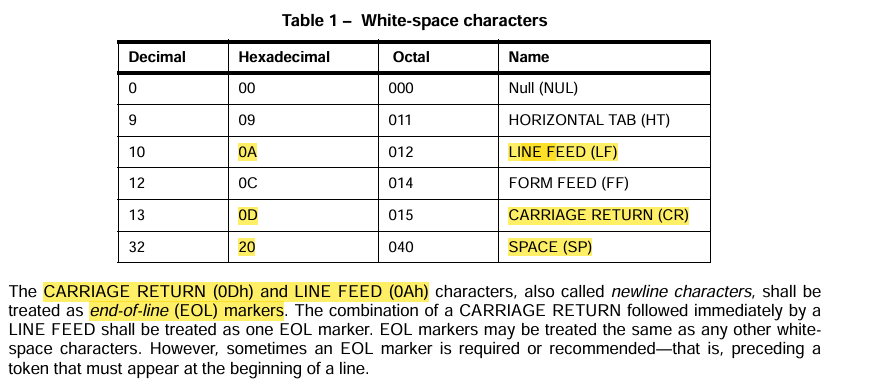
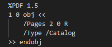
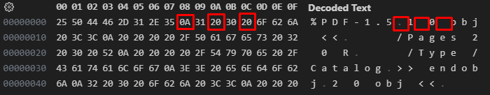
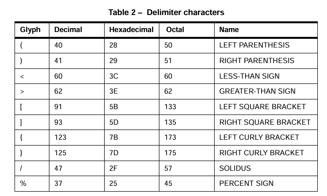
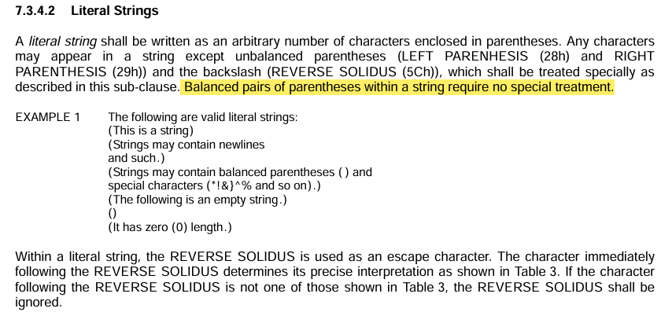
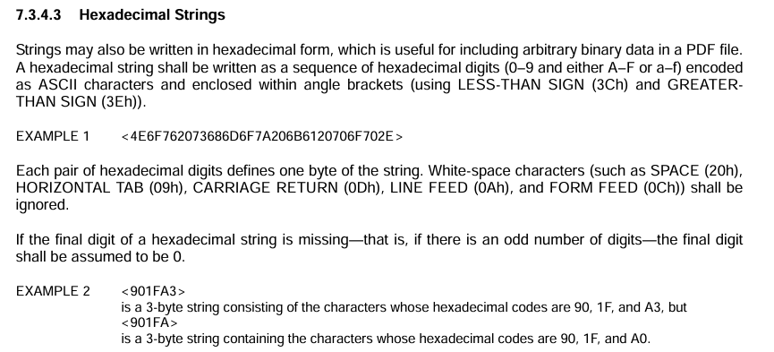
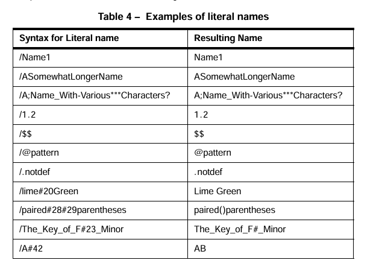

PDF Format

### 7. Syntax

#### 7.1 General

PDF syntax is considered as four parts: objects, file structure, document structure and content streams.

- object: a pdf document is a data structure composed from a small set of basic types of data objects, so object is basic data values of PDF document
- file structure: how objects are stored, accessed, updated in a pdf file
- document structure: specifies how the basic object types are used to represent components of a pdf document (pages, fonts, annotations,...)
- content streams: contains a sequence of instructions describing the appreance of a page or other graphical entity

#### 7.2 Lexical Conventions

a PDF file is a sequence of bytes

Example below:

- all characters except the white-space characters and delimeters are refered to as regurlar characters.
- pdf is case-sensitive.
- any occurence of the % sign outside a string or stream introduces a comment.

#### 7.3 Objects

- basic types of objects: bool, int, real number, strings, name, arrays, dictionary, streams and null object.
- objects may be **labelled** so that can be refered to by other objects, a labelled object is called an **indirect object**.

- the range and precision of numbers in real object may be litmited by the internal representations used in the computer on which the conforming reader is running.
- string object consist of a series of zero or more bytes, and it should be written in one of the following 2 ways: inside `()` (literal strings form, using character) or inside `<>` (hexadicimal strings form, using hexadicimal digits)
  
  
- name object is an atomic symbol uniquely defined by a sequence of any characters (8-bit values) except null (character code 0). uniquely defined means that any two objects made up of the same sequence of characters denote the same object. atomic means that a name has no internal structure.
  
- array object is a one-demensional collection of objects arranged sequentially and array object may be heterogenous (có thể chứa nhiều kiểu dữ liệu khác nhau).
- dictionary object is an associative table containing pairs of objects, known as the dictionary's entries. the first element of each entry is the key (shall be a name) and the second element is the value (may be any kind of object, including another dictionary). By convention, the `Type` entry identifies the type of object the dictionary describes and the value of `Type` should always be a name.
- a stream object is a sequence of bytes with unlimited length, so that objects with potentially large amounts of data such as images and page descriptions shall be represented as streams.

#### 7.4 Filters

#### 7.5 File Structure

### 8. Graphics

#### 8.6 Colour Spaces

#### 8.9 Images

### 9. Text

#### 9.9 Embedded Font Programs

#### 9.7 Composite Fonts

### 10. Interactive Features

#### 12.6 Actions

#### 12.6.4.16 JavaScript

### 12.7 Interactive Forms
