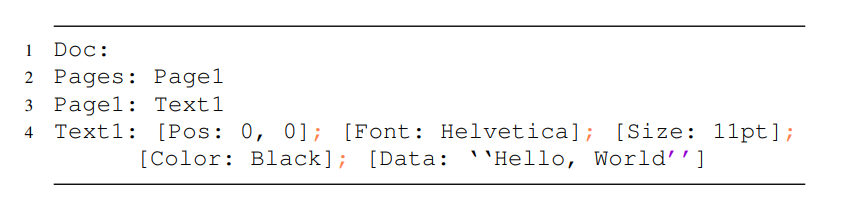

# Multi-level Fuzzing for Document File Formats with Intermediate Representations

- bài báo này tập trung vào các target là document software, cụ thể là các software xử lý files dạng document (html, pdf, docx,...)
- kết quả đầu ra của bài báo là phát triển một intermediate document representation (DIR) cho document files và đề xuất một multi-level mutations (ví dụ page level, objectlevel, attribute level,...) thực hiện ngay trên DIR của document. DIR sẽ biểu diễn document dưới dạng một tập các pages, trong các pages sẽ chứa các object mà trong các object lại chứa các attributes.
- nguyên nhân dẫn đến bài toán này là do các công cụ generation-based fuzzing và strucutre-aware mutation tools có 2 nhược điểm chính: đầu tiên là phải tự tạo một grammar model cho từng document format nên tốn thời gian; thứ hai là chỉ thực hiện mutations đơn level, cụ thể nautilus thực hiện mutation các sub-tree còn freedom thực hiện mutation các attribute của html files
- cách tiếp cận của bài toán là kết hợp generation-based fuzzing và structure-aware mutations, để kết hợp hai cái này lại với nhau cần 2 kĩ thuật mới gọi là intermediate document representation và multi-level document mutations. 

#### Intermediate Document Representation
- bất kì file document nào cũng có thể biểu diễn được dưới dạng trừu tượng cho dù định dạng của nó là gì, ví dụ, một file PDF có thể biểu diễn dưới dạng trừu tượng là "file PDF này có một trạng và hiển thị "Hello World" tại ví trí (x, y) sử dụng font chữ A, kích cỡ B và màu đen". Vậy chỉ cần xây dựng một grammar model cho DIR mà vẫn có thể fuzzing theo generation-based cho các định dạng khác nhau, ngoài ra còn có thể thực hiện mutations trực tiếp trong DIR.
- xây dựng `grammar model` cho một biểu diễn trung gian "chung" cho tất cả các định dạng. 
- Một document sẽ gồm nhiều page, mỗi page gồm nhiều object, mỗi object lại bao gồm một vài text, figure, table,...Mỗi object được mô tả bởi attributes của chính nó, một vài attribute chỉ tồn tại đối với một object nhất định, nhưng vài cái thì không, ví dụ như chỉ có object text thì mới có attribute font thôi.
Ví dụ về một DIR biểu diễn một file pdf chứa dòng text Hello World

- DIR có mục đích thiết kế khác so với IR của một định dạng file cụ thể, ví dụ FD-IR của FreeDom là thiết kế dành riêng cho Document Object Model (DOM).
#### Multi-level Document Mutation
- 2 phương pháp tạo `DIR` document: dựa theo `grammar model` của DIR để tạo `DIR` document ngẫu nhiên và chuyển documents từ định dạng khác về `DIR` document.
- sau khi tạo xong `DIR` document thì sẽ thực hiện chuỗi các mutations, phần lớn là áp dụng trực tiếp lên `DIR` document.
- các phương pháp mutation: 
    - `page level mutation`: duplicate một page ngẫu nhiên trong `DIR` document với một số lần ngẫu nhiên, xóa ngẫu nhiên một page, thay đổi thứ tự giữa các page, tráo một hoặc nhiều page giữa các `DIR` document. 
    - `object level mutation`: các thao tác tương tự với page và thêm `object insertion`, tức tự tạo thêm một object và trèn vào một ví trí ngẫu nhiên trong page, tuy nhiên vẫn đảm bảo tính rằng buộc giữa các object bằng cách sửa các object khác nếu cần.
    - `attribute-level mutations`: thêm attributes vào object (có thể tương thích với object hoặc cố tình không tương thích), thay thế attributes bởi một attribute mới hoặc mượn từ một object khác, ngẫu nhiên xóa một attributes của một object, thay thế giá trị của attribute.
- sau khi mutate xong, cần chuyển ngược lại từ `DIR` document sang định dạng thực tế, nếu sao khi chuyển sang định dạng thực tế mà branch coverage tăng thì sẽ chuyển `DIR` document đấy vào Post-DIR mutation seed queue.
- việc phát triển công cụ để convert từ `DIR` document sang định dạng thực tế rất tốn thời gian, tuy nhiên có nhiều SDK cung cấp interface để thực hiện việc này, ví dụ Foxit PDF SDK cung cấp API để tạo pdf, insert/delete pages trong một PDF document,...


## Keyword
- `grammar model` định nghĩa đầu vào hợp lệ của một chương trình, file format,... là như thế nào. `grammar model` thường được biểu diễn dưới dạng backus-naur 
```
<Object> ::= "{" <Members> "}"
<Members> ::= <Pair> | <Pair> "," <Members>
<Pair>    ::= <String> ":" <Value>
<Value>   ::= <String> | <Number> | <Object> | <Array>
```
- `generation-based fuzzing` là một phương pháp fuzzing mà fuzzer không bắt đầu với seed file (existing valid inputs) mà bắt đầu bằng `grammar model` để tạo input. Ưu điểm là gần như 100% các input tạo ra sẽ hợp lệ, nhược điểm là không tìm được các bug liên quan đến việc sửa data (trừ phi `grammar model` được thiết lập để cố tình làm điều này) và rất khó để viết được `grammar model` cho các định dạng phức tạp như PDF.
- `structure aware mutation` là phương pháp mutate tận dụng lợi thế của các seed files và grammar. fuzzer sẽ tạo Abstract Syntax Tree (AST) dựa trên seed và mutate (swap, replace, delete, insert) trên các node hoặc cụm vài node của AST đó.


