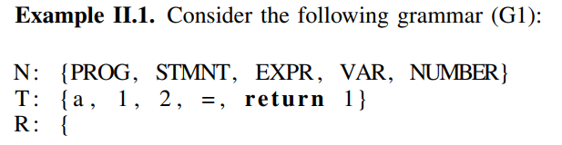

# Nautilus
- Mục tiêu là tạo seed đúng cả về mặt ngữ pháp và ngữ nghĩa bằng cách sử dụng ngữ pháp phi ngữ cảnh (context-free grammar).
- Đầu vào cần có là source code của target và ngữ pháp để tạo input.
- Sử dụng feedback để nâng cao hiệu quả.

### Context-Free Grammar
- Một vài khái niệm có liên quan:
    - `variable` hoặc `non-terminal symbol` là những "chỗ trống" cần điền giá trị vào.
    - `terminal symbol` là những từ hoặc chữ cái thực sự và không thể thay thế
    - `production rule` là quy tắc quy định xem một biến có thể được thay thế bằng cái gì
    - `start non-terminal` là điểm xuất phát
    - `derivation tree` là một dạng biểu diễn khác của kết quả sau khi được tạo ra bởi văn phạm phi ngữ cảnh, với `root` là kí hiệu bắt đầu và các cạnh là các `production rule`
- Một Context-Free Grammar là một tập các quy tắc theo dạng "một biến X có thể được thay thế bởi một hoặc nhiều giá trị từ một mảng các biến hoặc chuỗi" miễn biến X này không phải kí tự kết thúc. Ngoài ra, có một kí tự khởi tạo đặc biệt chỉ thị nơi bắt đầu áp dụng các quy luật này.
- Gọi đây là văn phạm phi ngữ cảnh vì trong các quy tắc của văn phạm, phía bên trái mũi tên chỉ được phép có duy nhất một non-terminal symbol, ví dụ: `A` $\to$ `B + C`, nghĩa là bất kì chỗ nào có A thì luôn có thể thay bằng B + C. Còn văn phạm có ngữ cảnh là `xAy` $\to$ `xBy`, nghĩa là chỉ được thay A bằng B khi phía trước và phía sau của A là x và y.
- Quy trình dẫn xuất, hay cách sinh ra chuỗi được thực hiện như sau:
    - Khởi động: Bắt đầu từ kí hiệu gốc `S`
    - Vòng lặp thay thế: Quét chuỗi hiện tại, tìm một rule bất kì rồi thay thế vế trái bằng vế phải, và chỉ dừng khi nào chuỗi chỉ chứa toàn là non-terminal symbol.
    Ví dụ: N là tập hữu hạn các non-terminal symbols, T là tập hữu hạn các terminal symbol (T và N không giao nhau), R là tâp hợp các production rule, S là ký tự bắt đầu. Một trong số những kết quả đầu ra có thể tạo được từ các tập này là: `a = 1`. Cụ thể, `PROG` $\to$ `STMT` $\to$ `VAR = EXPR` $\to$ `a = EXPR` $\to$ `a = NUMBER` $\to$ `a = 1`
    
    

### Minimization
- `subtree minimization` tạo subtree càng ngắn càng tốt bằng việc tuần tự thay thế subtree của từng node bằng subtree nhỏ nhất có thể tạo được tại vị trí subtree chuẩn bị thay thế.
- `recursive minimization` áp dụng sau `subtree minimization` với mục đích phát hiện các đệ quy và thay thế nó. Đệ quy ở đây nghĩa là tồn tại các rule cho phép thay thế bởi chính nó, ví dụ `expr` thay thế thành `expr + expr` hoặc thành `num`, và `num` thì chỉ thay thế được bằng một số ngẫu nhiên là được phép dừng rồi, nhưng nếu thay thế thành `expr + expr`, và rồi tiếp tục lặp lại như thế sẽ rất dài.

### Mutation
- `random mutation` chọn ngẫu nhiên một nút và thay thế subtree tại nút đấy bằng một subtree khác tương đương về mặt ngữ pháp, tưc phải có cùng gốc `non-terminal`, tức là có cùng root. Ví dụ thay thế biểu thức `expr` từ 1 thành 1 + 2 là hợp lệ.
- `rules mutation` thay thế một nút bằng một nút khác ngẫu nhiên có cùng gốc `non-terminal`.
- `random recursion mutation` chọn một subtree có tồn tại recursion và lặp lại quá trình recursion đấy một số lần nhất định.
- `splicing mutation` thay thế một subtree bằng một subtree từ input khác đang trong queue (và dĩ nhiên nó cũng phải cùng root).
- `afl mutation`

### Fuzzing Phase
- Sau khi tạo được một vài input ban đầu, `scheduler` quyết định input nào trong queue nên được thử tiếp theo. Trong queue luôn luôn chứa interesting input, tức những input được generate ra hoặc được mutate từ một input trước đó, và các input này trigger được ít nhất một transition giữa các basic block mà các input khác không trigger được.
- Quá trình lập lịch (hay lựa chọn input, scheduler) thực hiện tuần tự bằng việc xử lý từng input một, và để xử lý điều này, mỗi input sẽ được gán một state.
    - `init` $\to$ `det` $\to$ `detafl` $\to$ `random`
    - `init` là input mới tìm được (và chỉ có input tìm thêm được path mới thì nó mới nhét vào queue) sẽ được minimize ngay lập tức để giảm thời gian thực thi.
    - `det` (`deterministic`) áp dụng đột biến có tính quy luật (tuần tự và vét cạn), do đó, về mặt lý thuyết thì sẽ không thể tự tạo ra đột biến trùng lặp. Tuy nhiên, nó vẫn lưu trữ các input tạo ra được dưới dạng hash rồi và có kiểm tra lại nếu có trùng lặp (bước `check for duplicates`).
    - `detafl` áp dụng đột biến afl
    - `random` chỉ dùng đột biến ngẫu nhiên
- Nautilus chỉ thực hiện đột biến trên cấu trúc cây, do đó cần phải chuyển nó về dữ liệu thật thì mới dùng được.
- Nautilus chỉ dành một khoảng thời gian ngắn để đột biến input, hết giờ nó sẽ ngưng đột biến lại để chuyển sang input khác.

## Question
1. Nautilus chỉ cho phép generation ngẫu nhiên hay có cơ chế mutation và ưu tiên luật này so với luật khác không? Nếu có cơ chế mutation thì nó thu thập feedback như thế nào?
- có cơ chế mutation và thu thập feedback giống afl++
2. Có nên và được phép bắt chước lại phần minimization của nautilus không?