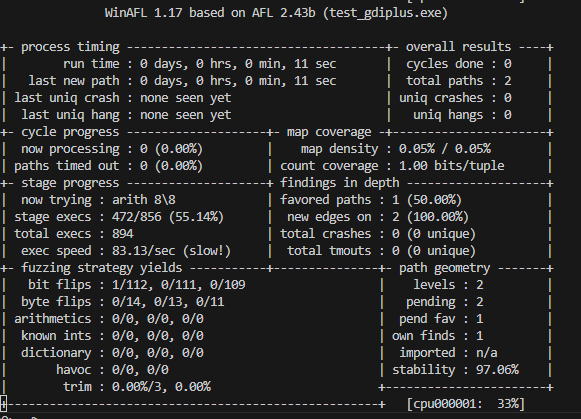
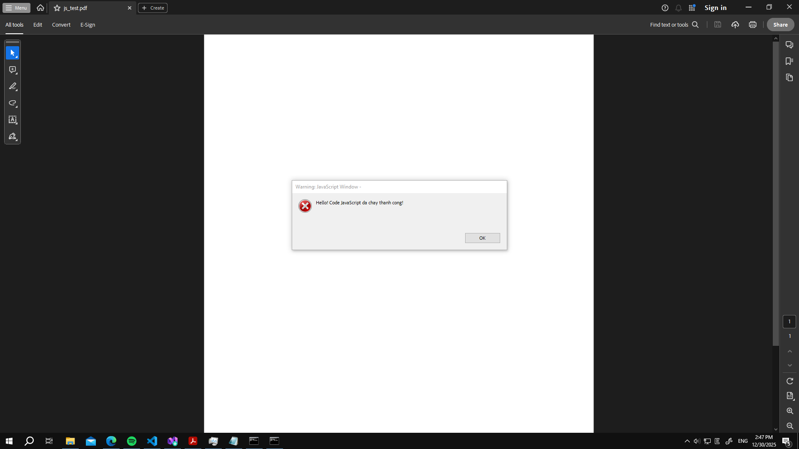

## Task

#### Install WinAFL with DynamoRIO

1. `git clone -r https://github.com/googleprojectzero/winafl`
2. Install DynamoRIO release for Windows and unzip
3. Install Visual Studio
4. Install `desktop development with C++` packages. This package includes MSVC Compiler, Windows SDK (headers, library, debuggers, documents,...) and build tools (CMake and MSBuild).
5. Open `x86 Native Tools Command Prompt`
   1. This terminal will run a script to reconfig environment variables, so that this terminal will use 32 bit compiler runs on this Windows 64 bit machine to generate 32 bit binary executable files (.exe).
   2. Windows 64 bit (x64) can run both 64 bit and 32 bit software applications (based on WOW64)
   3. Only 32 bit application can load 32 bit library. AcroRd32.exe is 32 bit so that winafl.dll must be 32 bit, then AcroRd32.exe can load this library.
6. `cmake -G "Visual Studio 18 2026" -A Win32 .. -DDynamoRIO_DIR=D:\DynamoRIO-Windows-11.90.20444\DynamoRIO-Windows-11.90.20444\cmake`
   1. Create project for `Visual Studio 18 2026`
   2. Architecture 32 bit
7. `cmake --build . --config Release`

#### Fuzzing an arbitrary application with WinAFL (with DynamoRIO)

1. Modify `gdiplus.cpp` into `extern "C" __declspec(dllexport) int main(int argc, char **argv)` so that `gdiplus.cpp` will export symbol `main()`
2. Check dumpbin in x64 Native Tools, verify symbol `main()` has already been exported
   
3. `afl-fuzz.exe -i in -o out -D D:\DynamoRIO-Windows-11.90.20444\bin64 -t 5000 -- -coverage_module test_gdiplus.exe -target_module test_gdiplus.exe -target_method main -nargs 2 -- test_gdiplus.exe @@`
   
   `--`: ngăn cách các phần, bao gồm: afl options, instrument options và target command line
   **[afl options]**
   `-i in`: input directory
   `-o out`: output directory
   `-D D:\DynamoRIO-Windows-11.90.20444\bin64`: DynamoRIO path
   `-t 5000`: timeout 5000 milisecond, nếu sau 5000 milisecond mà hàm mục tiêu chưa chạy xong thì coi là treo và khởi động lại tiến trình
   **[instrument option]**
   `-coverage_module test_gdiplus.exe`: chỉ định module (.exe hoặc .dll) muốn xác định coverage, có thể dùng nhiều lần để đo nhiều mục tiêu cùng lúc
   `-target_module test_gdiplus.exe`: module chứa hàm mục tiêu
   `-target_method main`: tên hàm mục tiêu để thực hiện chạy persistent mode
   `-nargs 2`: số lượng tham số của hàm mục tiêu, trong trường hợp này hàm main có 2 tham số là argc và argv
   **[target command line]**
   `test_gdiplus.exe`: tên chương trình cần chạy
   `@@`: ký hiệu đặc biệt của afl, khi chạy afl sẽ sinh ra một input mới và thay thế vào kí hiệu @@ này.
4. If `gdiplus.cpp` didn't export symbol, We have to use `-target_offset` (refer to https://github.com/googleprojectzero/winafl/blob/master/readme_dr.md), but I don't know how to do it yet.

#### Generate a simple JS and embedded in pdf via pikepdf

#### Runs Adobe Reader with DynamoRIO

#### List sensitive API of AcroJS

## Takeaway

## Question

1. Mục tiêu là phát triển 1 dynamic library (.dll) đóng vai trò là custom mutator của WinAFL. Khi WinAFL cần tạo một input mới, nó sẽ gọi hàm `dll_mutate_testcase` trong `.dll`, hàm này sẽ gọi trực tiếp Nautilus để sinh ra đoạn script JavaScript mới
