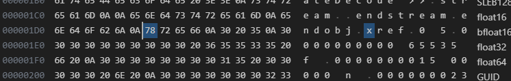
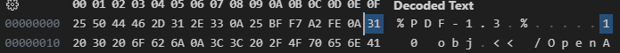

## Task

#### AcroJS
- Mục tiêu:
    - Xác định những API quan trọng, có khả năng bị tấn công.
##### 1. Tiêu chí đánh giá API
1. Liên quan đến việc quản lý vòng đời của object, ví dụ như tạo, xóa, sửa,...vì có thể gặp lỗi use-after-free liên quan đến việc một đối tượng vẫn duy trì tham chiếu đến đối tượng đã bị thay đổi.
    - addAnnot / deleteAnnot
    - addField / removeField
    - deletePages / insertPages
    - destroy()
2. Xử lý dữ liệu phức tạp do C++ phải xử lý phần này
    - util.scand
    - util.printf
    - XMLData
    - ReadStream / WriteStream.
3. Các API legacy
    - media, sound, screen
    - context3D
    - spell
    - collab
4. Tương tác hệ thống
    - app.launchURL
    - doc.importDataObject
5. Đã từng bị khai thác trong quá khứ
    - collab
    - Annot, ScreenAnnot, RichMedia
    - xfa.resolveNode, xfa.host
#### Grammar
- Mục tiêu:
    - Xây dựng văn phạm để tạo các file pdf chứa những API quan trọng cần tấn công.
##### Các Grammar đã tạo được:
1. addAnnot
`/home/hoangnh8/master-thesis-daily-logs/logs/addAnnotGrammar.py`

## Takeaway
- AcroJS cho phép thao tác với AOM (Acrobat Object Model), ví dụ như: `app`, `doc` (tệp PDF hiện tại), `util`, `event`, `security`.
- Phần code JavaScript sẽ nằm trong giá trị của khóa `/JS`, thuộc một object có kiểu là `/Action` và `/OpenAction`.
- `safe path` is a path on local hard drive that passed to JavaScript methods, a path can't point to system critical folder, for example, root directory.
- `privileged context` is a context in which you have the right to do something that is normally restricted. For example, trusting a document certifier's certificate for executing JavaScript creates a `privileged context`.
- some JavaScript methods have security restrictions, these methods can be executed only in a `privileged context`.
- Giải thích file PDF:
    ```
    %PDF-1.3
    %����
    1 0 obj
    << /OpenAction << /JS (\napp.alert\("Hello! Code JavaScript da chay thanh cong!"\);\nvar a = 10;\nvar b = 20;\nconsole.println\("Ket qua: " + \(a+b\)\);\n) /S /JavaScript >> /Pages 2 0 R /Type /Catalog >>
    endobj
    2 0 obj
    << /Count 1 /Kids [ 3 0 R ] /Type /Pages >>
    endobj
    3 0 obj
    << /Contents 4 0 R /MediaBox [ 0 0 612 792 ] /Parent 2 0 R /Resources << >> /Type /Page >>
    endobj
    4 0 obj
    << /Length 0 /Filter /FlateDecode >>
    stream

    endstream
    endobj
    xref
    0 5
    0000000000 65535 f 
    0000000015 00000 n 
    0000000235 00000 n 
    0000000294 00000 n 
    0000000400 00000 n 
    trailer << /Root 1 0 R /Size 5 /ID [<db52d5076dc5b9e9139dbf75a1436839><db52d5076dc5b9e9139dbf75a1436839>] >>
    startxref
    470
    %%EOF
    ```
    - `407` (0x1d6) là byte offset của xref tính từ đầu file 
    - `<<` và `>>` (hay còn gọi là dictionary) là ký hiệu bắt đầu và kết thúc của metadata (tức phần mô tả của object), trong này sẽ chứa các giá trị kiểu key-value. Key bắt buộc phải là một name object và bắt đầu bằng dấu `/`, ví dụ `/Type`, `/Pages`. Value có thể là số, chuỗi, mảng hoặc tham chiếu gián tiếp hoặc một dictionary khác lồng vào trong.
    - `stream` và `endstream` là ký hiệu bắt đầu và kết thúc nội dung (payload) của object.
    - `xref` để biểu thị bắt đầu bằng `cross-reference table`, trong đó `0 5` thông báo có 5 dòng liên tiếp, mỗi dòng mô tả vị trí của các object, bắt đầu từ object 0. Dòng đầu tiên là dòng đặc biệt, đánh dấu danh sách các object đã bị xóa, `65535` là số thế hệ max, `f` nghĩa là free. Các dòng tiếp theo thông báo vị trí của các object còn lại, ví dụ, `0000000015 00000 n` tức object số 1 đang nằm tại byte thứ 15 (`0xf`) của file và vẫn đang hoạt động (`n`), `generation number` là `00000`. PDF hỗ trợ `increment number`, khi xóa hoặc sửa một object, PDF sẽ đánh dấu object cũ là đã xóa và tạo object mới, nếu sau này có sử dụng lại ID của object cũ thì sẽ tăng `generation number` lên. 


## Questions
1. Đọc tài liệu AcroJS nhiều quá nên dễ nản, do đó muốn triển khai pipeline trước, tức khiến cho hệ thống WinAFL + Nautilus + Adobe Reader hoạt động, rồi sau đó bổ sung thêm các API, các văn phạm và cơ chế lập lịch sau.
2. Trong Nautilus cũng có chế độ mutate, cho phép giữ nguyên phần thân cây (tức nơi chứa luật nào đó muôn giữ) và thay đổi giá trị của các nhánh lá khác (tức các tham số), thay vì chỉ tạo mới một cách ngẫu nhiên. Có thể áp dụng cái này vào trước khi sử dụng machine learning.
    - AFL++ sử dụng cơ chế lập lịch dựa trên năng lượng (dựa trên toán học thống kê). Nguyên lý hoạt động là AFL++ gán cho mỗi file đầu vào một mức năng lượng, năng lượng cao thì được mutate nhiều lần và cho phép chạy lâu và ngược lại. Tiêu chí đánh giá mức năng lượng dựa trên: độ hiếm đường đi (càng hiếm năng lượng càng tăng), thời gian thực thi (càng nhanh năng lượng càng tăng), độ bao phủ (bao phủ nhiều năng lượng tăng).
    - AFLSmart sử dụng cơ chế lập lịch giống như AFL++ nhưng thêm một tham số là tính hợp lệ. Nếu một input sau khi mutate mà vẫn giữ được cấu trúc đúng thì mức năng lượng của nó sẽ tăng và ngược lại.